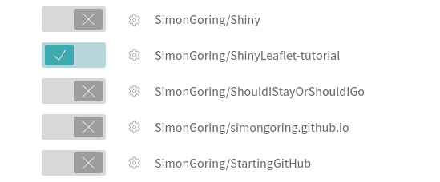

<style>
h1:
</style>

By: Simon Goring

# Self-Testing and Continuous Integration

[RMarkdown documents](http://rmarkdown.rstudio.com/) are really helpful tools for developing papers.  Ultimately, they can be compiled to finished papers, but they also serve as excellent teaching tools, they can look very polished, using different CSS stylings, and they give you a lot of control over the execution of your R workflow.

I use RMarkdown documents for most of my research coding, and I use GitHub extensively both to collaborate and for project management on projects for which I am the sole author.  Most of my recent papers have been developed openly on GitHub as well.  Goring and Williams ([2017](http://dx.doi.org/10.1111/ele.12747)) and Goring et al. ([2016](http://dx.doi.org/10.1371/journal.pone.0151935)) were entirely written using public version control, and there are more papers in development.  These open-development papers are (for the most part) accompanied by a Contributor Code of Conduct and an authorship invitation.

Recently I've been thinking about how to manage version control more efficiently with the tools I've used as part of rOpenSci's package management for our [neotoma R package](http://github.com/ropensci/neotoma).  One of the things I really enjoyed is the use of continuous integration in code development with the package.  Continuous integration is a practice borrowed from software development, where code is expected to be stored within a repository that includes an automated build procedure and, preferably, self-testing elements.

The objective for continuous integration is to minimize the time between committed changes and the notification of changes that break the code.  Frequent commits are important for managing code.  If you are making commits often, and making use of content-rich commit messages, then it helps you keep track of the decisions and choices that go in to developing your project.

<object type="image/svg+xml" data="../images/virtuous_cycle.svg" style="width:100%;">
  The Virtuous Cycle
  <!-- fallback image in CSS -->
</object>

This shows a virtuous cycle for RMarkdown document development.  In this cycle you would edit the document, save & commit, and then push.  Once in the cloud an automated build process (with RMarkdown this would be some version of the `rmarkdown::render()` function) would be initiated.  While the build was happening you could continue editing, with the knowledge that a passing (the green light; a successfully rendered RMarkdown document) or a failing build (red light) would immediately trigger some sort of notification, such as an email, or, at the very least, a "Passing" or "Failing" badge for your repository:

[](https://travis-ci.org/PalEON-Project/stepps-baconizing)

This means that you can offload the need to continuously render your RMarkdown document, and it ensures that your document builds successfully on a completely clean system, so that any unintentional dependencies on your own specific system can be reduced.

So, lets say you're now convinced.  What are the next steps?

<object type="image/svg+xml" data="../images/noun_221915_cc.svg" style="margin-left:auto; margin-right:auto; display:block;width:20%">
  Zombie walking.
  <!-- fallback image in CSS -->
</object>

<br>

# Getting Started With Continuous Integration for RMarkdown

I've borrowed these headings from the well written [Wikipedia Continuous Integration page](https://en.wikipedia.org/wiki/Continuous_integration).

## Maintain a code repository

This should be straightforward.  Whether you use [GitHub](http://github.com), [GitLabs](http://gitlab.com), BitBucket or one of the many other repository systems, maintaining a code repository and using version control with your projects should be a critical part of your writing process now, especially if your writing includes significant code elements.  The repository acts as a back-up directory, it's often free, and, when linked to a version control system, has the advantage of helping to promote best practices, both for yourself, and for the community.

This page will demonstrate how to accomplish these tasks using [GitHub](http://github.com) and [Travis-CI](https://travis-ci.org).  There are a number of other CI options, many free for public repositories, and it's always possible to use multiple CI systems.  Some other options are [CircleCI](https://circleci.com/), [CodeShip](https://codeship.com/) and [AppVeyor](https://www.appveyor.com/).

## Automate the build

With RMarkdown documents, automating the build is the critical step.  I'll show here how to manage the system with [Travis-CI](https://travis-ci.org/).  Travis is an open source project, and it gives back to the community by providing free CI for public GitHub repositories. 

Log in to Travis with your GitHub account and then open up your profile.  Travis immediately discovers all your projects (and, if you belong to GitHub organizations it will link to those as well).  Once you've set up your Travis account and linked it to your GitHub account, you need to select the GitHub repository that you want to link to Travis to manage your CI system:



Once you've selected the repository you want to use CI with, you need to tell Travis what it's going to build. You do that using a `yaml` file, a `DESCRIPTION` file and a `Makefile`.  You can look at my setup in the [`stepps-baconizing` repository](https://github.com/PalEON-Project/stepps-baconizing), but I'm going to run through it here for you.


### The yaml file

The first file you need is the `.travis.yml` file.  Because it is prepended by a period it will be a hidden file on your system, but you can make it with any text editor you'd like.  It helps tell Travis how to actually build your file:

```yaml

language: r
sudo: false
script: make bacon
cache: packages
r_packages:
  - rmarkdown
  - neotoma
  - purrr
  - ggplot2
  - plyr
  - reshape2
  - mgcv
  - Bchron
  - viridis
  - dplyr
  - readr
  - gridExtra
os:
  - linux
  - osx
```

Let's step through the file:

<h4 style="font-family:monospace;">language: r</h4>

This `yaml` file tells Travis that it will be building an R document.  Travis' documentation shows support for [a number of languages](https://docs.travis-ci.com/user/languages/).  Each language has its own set of options.  The [documentation for R's yaml file](https://docs.travis-ci.com/user/languages/r/) is well written and worth a read.

<h4 style="font-family:monospace;">sudo: false</h4>

If you are used to Linux systems then the use of `sudo` should be fairly well understood.  `sudo` provides you with administrator privileges on a system.  Using `sudo: required` generates an entire OS system.  This means that the build setup time is much longer (20-52s compared to 1-6s), but it gives you a much higher memory overhead (7.5GB compared to 4GB).

<h4 style="font-family:monospace;">script: make bacon</h4>

We're going to get to the `Makefile` in a little bit, but, effectively, the `Makefile` will have a set of command-line arguments that will be called when the command, in this case `make bacon` is used.  If you have a different `Makefile` setup, then you might change the call.  If you're using a different language, or build system you might also change this `script` argument, but this will do for now.  You will eventually change the `bacon` part of this `script` variable to something else more suited to your own build.

<h4 style="font-family:monospace;">cache: package</h4>

Caching can help improve the build time.  This means that package dependencies are saved in between builds.  It is said to improve build time, but I haven't tested this.

<h4 style="font-family:monospace;">r_packages:</h4>

This list of packages includes all the packages I used in the RMarkdown document.  It is used to pre-load the packages, but it can't be used on its own, for these R builds you need a `DESCRIPTION` file as well.

### The DESCRIPTION file

To build in Travis you also need a description file.  Hadley Wickham describes the DESCRIPTION file well in the [Package Metadata](http://r-pkgs.had.co.nz/description.html) page of his [R Packages](http://r-pkgs.had.co.nz/) book (and website).

It's useful to have this information anyway since it includes a lot of relevant information, including the need to define contributors early (remember, defining ad refining contributions early and often helps avoid problems down the road).  Take a look at either Hadley's chapter, or [our DESCRIPTION file](https://github.com/PalEON-Project/stepps-baconizing/blob/master/DESCRIPTION).  The most critical elements here are the packages that you define.  The build will fail if you don't include all the packages.  It will also fail if you don't define the authors properly (I had that problem initially!).

### The Makefile

There are a number of excellent resources that describe why and how to use `make` files for R.  Rob Hyndman's post on [Makefiles for R/Latex](http://robjhyndman.com/hyndsight/makefiles/) is a good start as is Karl Broman's [Minimal make example](http://kbroman.org/minimal_make/).  The idea is simply that this becomes an executable file, with a set of commands, that Travis will automatically run.  In my example:

```bash
bacon: Baconizing_paper.Rmd
  Rscript -e 'rmarkdown::render("$<")'
  
clean:
  rm -rf *.html *.md *.docx figure/ cache/
```

There are two separate `make` options.  The first is called `bacon`, and it's the one we call with the `script` variable up in our yaml file.  I called it `bacon` because we're looking at a software program called Bacon, but you can give that command any name you want.

This example is a bit fancy.  Because `Baconizing_paper.Rmd` is on the same line as the declaration of `bacon` it is determined to be a dependency.  This means that the command (`RScript -e 'rmarkdown::render("$<")'`) is run on the file `Baconizing_paper.Rmd` only when the Rmd file is updated.

So, with the Travis system turned on for your repository and these three files (the `.travis.yml`, the `DESCRIPTION` and the `Makefile`) in your repository, you can get started with continuous integration.

<object type="image/svg+xml" data="../images/noun_168968_cc.svg" style="margin-left:auto; margin-right:auto; display:block;width:20%">
  Two people giving a sweet high five.
  <!-- fallback image in CSS -->
</object>


## Make the build self-testing

The easiest, and most basic level of self-testing for an RMarkdown document is making sure it will render.  Since we've set up our `Makefile` for Travis to run the command `rmarkdown::render("filename")` this should be straightforward.  The real challenge now is to build testing units into the RMarkdown file, or testing elements into a separate file that can be run alongside the `render()` command.

The easiest way to do this inside the RMarkdown document is to add assertions to your code chunks.  The package [`assertthat`](https://www.r-project.org/nosvn/pandoc/assertthat.html).  The functions in `assertthat` are useful because they can return either error messages (as is the case with `assert_that()`) or text strings that would allow the `render()` to pass but the error to be logged (the case with `validate_that()`).

So, for example, we could set up a chunk that is intended to evaluate some operation, and that we expect to have no NA values (if it's run properly):

```r
input <- read.csv('somefile.csv')
input_sums <- rowSums(input[,2:12])

assert_that(noNA(input_sums))

histogram(input_sums, main = "The sums of the inputs!")
```

In this case we might know *a priori* that the values should have no NA values, and so the `rowSum()` shouldn't contain NA values, unless something's wrong.  Here, we wouldn't know that something was wrong because `hist()` just ignores NA values, but it might be a sign something's wrong with our data analysis.  Using `assert_that()` would cause the build to fail and would return an informative error message.

## Everyone commits to the baseline every day


<object type="image/svg+xml" data="../images/commit_sjg.svg" style="float:right; display:block;width:15%">
  Committing to the cloud.
  <!-- fallback image in CSS -->
</object>

Well, come on now.  How hard is it to make those commits?  You need to make your commits a habit.  Don't be too verbose, be willing to accept that some times you have to make a half-baked commit just to get back on the wagon, but try your best to stay on the horse.  It's really helpful if you need to switch between computers, and especially helpful to be collaborating with someone else to keep you honest and in practice.

## Every commit (to baseline) should be built

With Travis (or other systems) this goes without saying.  The nice thing here is that each build is clean.  Because Travis re-builds its system each time, importing the latest libraries and version of R (in our case), you never have to worry about cached results or other elements that might be making your build *seem* to work when really there's some sort of artifact in your system that allows it to appear to function properly.  ("Oh yeah, that `.RData` file. . . ")

## Keep the build fast

I've got a trick I like to use.  I use a `version` flag at the top of my code.  Long analytic steps result in output that gets saved to `saveRDS(paste0("data/output/file_v",version,".rds"))`.  Then, if I'm just making small changes to the code I can check for the RDS file first, before I go into the convoluted analysis.  If the change is big enough, I just increment the version number and those `rds` files get re-generated.  This speeds up build time, but it requires a bit more foresight as far as writing your tests goes.  Some of them will only get activated on a new version number.

## Test in a clone of the production environment

Again, thanks Travis!  Each time you build a clean platform (Linux) is generated and new packages are installed.  All the files come from your repo.  Want to make sure your code is completely reproducible?  CI to the rescue.

## Make it easy to get the latest deliverables

Travis does have an option to pass your output files to a new location (otherwise they disappear when the build container disappears) such as GitHub pages.  The documentation section on [GitHub Pages Deployment](https://docs.travis-ci.com/user/deployment/pages/) is very helpful, although I haven't gotten that far in my own use yet.  It basically means adding a few extra lines to your 

## Everyone can see the results of the latest build

We've talked about the badges, and you can also add email notifications.  Every time my builds break I get email after email letting me know about it.

## Automate deployment

Travis and AppVeyor have badges that you can add to your `README` page, so that you can tell everyone who visits the repo if the build has been successful:

[](https://travis-ci.org/PalEON-Project/stepps-baconizing)

The markdown for this is really interesting:

```md
[](https://travis-ci.org/PalEON-Project/stepps-baconizing)
```

There's alt-text (`Build Status`) within an image (the `` Markdown format) that is generated based on whether the build is passing, failing or in progress.  The link then goes to the build page on `travis-ci.org`.  I can accept it if you don't think it's cool, but I do.

# Big Conclusions

This is it really.  There's not much more to say.  If you've followed this and been able to get your CI system up, then congratulations!  Using CI has been very helpful for me, and I think it has some applications that haven't yet been realized, particularly for large systems with integrated documentation.  Anyway, good luck & have fun!