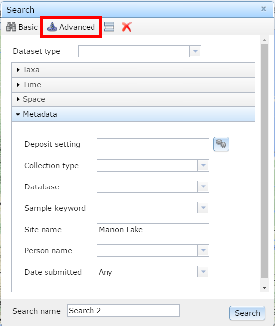
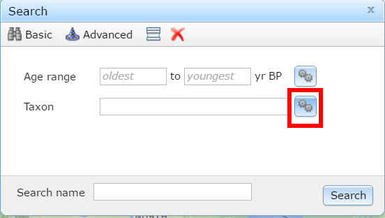
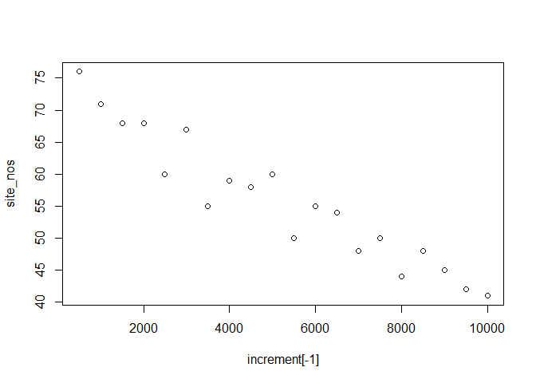
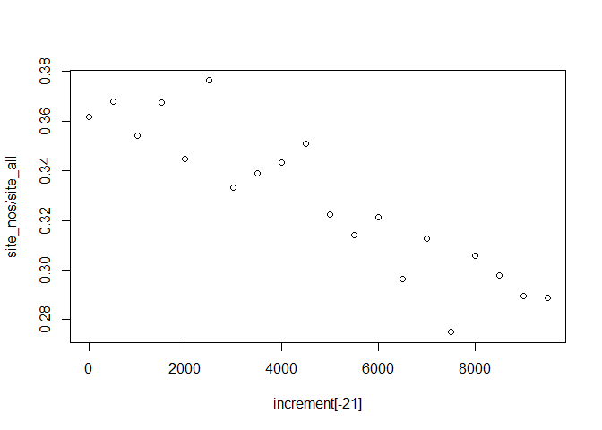

By: Simon Goring

***

**Table of Contents**

* TOC
{:toc}

***

# Paleo-Computing

Much of the work done by paleoecologists rests on single sites, or a collection of a few sites. Paleoecologists like to spend time in the field, or, more appropriately, in the middle of lakes, swamps and bogs, collecting sediment so they can then expose it to some of the worst kinds of chemicals.  Do they secretly hate mud?  We'll never know, but they spend a lot of time trying to dissolve it.

Efforts such as COHMAP have really changed the way that paleoecological data is used, and the way it's stored.  COHMAP brought together a number of paleoecolgists and climate modelers, to help the modelers understand how past climate might have behaved (or how it was reflected in past records of vegetation) so they could improve their computer models.

One of the offshoots of COHMAP was the North American Polen Database, originally housed at NOAA Paleoclimatology.  NOAA still has copies of much of the data, but in 1998 Eric C. Grimm of the former Illinois State Museum, along with Russ Graham of Penn State, created the Neotoma Paleoecological Database, a database that contained both plant and mammal fossil data from across the Pleistocene.

The database has undergone several periods of change.  From a small Access Database to a SQL Server database hosted on servers at Penn State, offering web-based search tools, educational outreach and housing thousands of unique paleoecological records from around the world, Neotoma has grown, and continues to grow.  

This lesson will help you understand how we make inference in paleoecology, from a single site, to continental scales, from the near-modern to deep time records.  I've made an effort to make this as simple as possible for people who have little computing experience, but there may be commands here that seem complicated.

# Getting Started

There are two resources we'll be using.  The first is Neotoma Explorer.  We're going to do some simple searches, so you can get a sense of how some of this research is done.  Once we have a good handle on things we'll get into the R programming.

## A Simple Overview

<div style="float: right; width: 300px; margin: 0 0 15px 20px; padding: 15px; border: 1px solid black; text-align: left;">

<br><b>Figure 1</b>. Searching for Marion Lake using the Neotoma Explorer's search tools.
</div>

This lesson is adapted from documents developed during the Neotoma Educational Workshop at Carleton College, MN ([link](http://serc.carleton.edu/neotoma/index.html)).

### Your First Search

The Neotoma Explorer -- [apps.neotomadb.org/explorer/]() -- provides a spatial overview and search tool for Neotoma.  One of the simplest things you can do with the database is to search for a single site.  To do this we can go to the search panel and look for the "Metadata" search option under the "Advanced" tab.  One of the best pollen sites ever is "Marion Lake".  *Search for Marion Lake*.  Once you've found it, open it up and figure out why it's such a great site.

When you click on the point you should see some site information and a description, along with a green P and a small clock icon with the word `MARION` beside them.  These represent pollen data and geochronological data respectively.  *Click on the pollen data* first and scroll through the tabs available to you.  You'll see:

* **Samples** -- Individual pollen counts, depth information and summary chronology.
* **Diagram** -- For data where diagrams are possible (pollen, diatoms, etc.) a tool to draw the diagram.
* **Site** -- Site level information for the data.
* **Chronology** --  The age model used for the record.
* **Publications** -- Publications related to the dataset.

This then provides you with a pretty good overview of the dataset, long term changes at the site, and the papers you might read to get more information.

*Try using Explorer to draw the pollen diagram.*

### More Searching

Lets look for data of a particular type.  *Create a new search for a **Dataset Type** (make sure you clear the site name)*.  What do you see?  How does that dataset look different from the pollen dataset we looked at earlier?  Why?

### More Details

Now *click on the white polygon on the top bar*.  It's still a bit finnicky.  If you enter a date (say 21100), hit enter, and then zoom out, you'll see the ice sheets overlain on the continent.  You can use this to help understand paleo distributions of taxa, their presence or absence.

### Research Questions

<div style="float: right; width: 300px; margin: 0 0 15px 20px; padding: 15px; border: 1px solid black; text-align: left;">

<br><b>Figure 2</b>. Clicking the gear box helps make things happen.
</div>
We know that Mastodon is a progressive heavy metal band, thrice nominated for a Grammy award, but did you know it was also a species of extinct mammutid proboscideans?  You should have, that seems like a pretty obvious fact.

We tend to picture late-glacial environments as being cold, similar to tundra environments.  Places like Beringia spring to mind.  *Do a taxon search for* Mammut *(mastodons) and look at the site locations that appear*.  What happened?

We can find more records by doing a multi-taxon search.  *Click the gear box to search for multiple taxa*, let's search for all the *Mammut*s we can find in the list.  Make sure to choose the right *Taxa Group*.  Where are the Mastodons?

We can also look for sites with common forest taxa.  Let's look for sites with *Picea* in them, and, since *Mammut* went extinct somewhere around 12,000ybp [@gill2009pleistocene], lets limit our search to all sites with *Picea* taxa, abundance over 20% and a time range of 15,000 -- 12,000 ybp.  What can we say about our friends the mastodons?

# Starting Out in R

R is statistical software.  R is a programming language.  R is a valuable tool.  R is your best friend.  R would never let you down (would you R?).  R can also be a bit daunting.  This section is designed to give you a very gentle introduction, and to show you how powerful the database can be as a tool for discovery.

## Finding a Single Site (Installing the Package)

Let's start out by using R to find Marion Lake again.  The first thing to know is that R itself doesn't know how to find these data.  Base R "knows" how to calculate averages (the `mean` command), do linear regression (the `lm` command) and plot, among other things.  R knows some basic things, but to do more you need to load in packages.  Luckily R makes this very easy.  To load in the `neotoma` package, all you have to do is open RStudio and type the command:


```r
install.packages('neotoma')
```

This loads the package onto your computer.  You can put it into memory using the command:


```r
library(neotoma)
```

Now lets find Marion Lake:


```r
marion <- get_site(sitename = "Marion Lake*")
```

```
## The API call was successful, you have returned  1 records.
```

If you type out `marion`, you'll get some site information.  To see what datasets are associated with this site you can type:


```r
get_dataset(marion)
```

```
## A dataset_list containing 2 objects:
## Accessed from 2016-07-01 09:46h to 2016-07-01 09:46h. 
## Datasets:
##  dataset.id                         site.name      long      lat
##        1705 Marion Lake (CA:British Columbia) -122.5472 49.30833
##        8377 Marion Lake (CA:British Columbia) -122.5472 49.30833
##            type
##  pollen        
##  geochronologic
```

So we can see both a pollen dataset and a geochronologic dataset.  We can look at the pollen data using the function `get_download`:


```r
marion_pollen <- get_download(marion)
```

```
## Fetching datasets for the site(s)
```

```
## Getting downloads:
```

```
## API call was successful. Returned record for Marion Lake(CA:British Columbia)
## API call was successful. Returned record for Marion Lake(CA:British Columbia)
```

```
## The dataset ID 8377 is associated with a geochronology object, not count data.
```

There are some warning messages.  THis is because we don't download geochronologic datasets this way (there is another, `get_geochron` function to do that).  So now, `marion_pollen` is just the pollen data for the one site (along with other metadata).  In a `download_list` there are different parts.  The pollen counts are stored in the `counts` table, the taxon list is stored in `taxon.list`.  Because downloads often come in batches you need to access objects as part of a `list`, so even though there is only one `download` in this case, the counts are found in `marion_pollen[[1]]`, not just `marion_pollen`:


```r
head(marion_pollen[[1]]$taxon.list)
```

```
##           taxon.name variable.units variable.element variable.context
## 1              Abies           NISP           pollen               NA
## 2    Acer circinatum           NISP           pollen               NA
## 3              Alnus           NISP           pollen               NA
## 4      Amaranthaceae           NISP           pollen               NA
## 5 Asteraceae undiff.           NISP           pollen               NA
## 6             Betula           NISP           pollen               NA
##       taxon.group ecological.group
## 1 Vascular plants             TRSH
## 2 Vascular plants             TRSH
## 3 Vascular plants             TRSH
## 4 Vascular plants             UPHE
## 5 Vascular plants             UPHE
## 6 Vascular plants             TRSH
```

There are more examples in the `neotoma` package paper [@goring2015neotoma] and in the package help.

# Biogeographic Patterns

We're going to do a really simple example.  We're going to make a set of calls to the `get_dataset` command, looking for all sites with *Tsuga* in them at 500 year intervals.  We're going to limit our searches to the west coast, a bounding box from [-150^o^W, 20^o^N] to [-100^o^W, 60^o^N].  The `get_dataset` function will help us do that:


```r
one_slice <- get_dataset(taxonname='Tsuga*', loc=c(-150, 20, -100, 60), ageyoung = 0, ageold = 500)
```

```
## The API call was successful, you have returned 76 records.
```

So, this call gets 76 results.  Now we need to figure out a way to loop this, and to get the total number of sites returned.  First, lets create a *vector* of values, from 0 - 10000, incrementing by 500:


```r
increment <- seq(from = 0, to = 10000, by = 500)
```

We can replace parameters in our original call with the `increment` variable, or at least, the first element of it this way:


```r
one_slice <- get_dataset(taxonname = 'Tsuga*', 
                         loc = c(-150, 20, -100, 60), 
                         ageyoung = increment[1], 
                         ageold = increment[2])
```

```
## The API call was successful, you have returned 76 records.
```

You should get 76 results again.  A variable is just a box for a value.  `increment` is a vector, a set of integer values, in order.  We could increase the values of the indices (the `[1]` and `[2]`) programmatically, so that we keep getting new time slices using a `for` loop.  Don't run this yet, but know that now, each time this is run, the time interval defined by `ageyounger` and `ageolder` will increment by one.

```r
for(i in 1:20){
  
  one_slice <- get_dataset(taxonname = 'Tsuga*', 
                           datasettype = 'pollen', 
                           loc = c(-150, 20, -100, 60), 
                           ageyoung = increment[i], 
                           ageold = increment[i + 1])
}
```
The problem is, each itteration of the `for` loop overwrites the variable `one_slice`.  I actually don't care what the datasets look like, I just want to know the number of datasets, so we can create a new variable, filled with 20 `NA` values, one for each itteration of the loop:


```r
site_nos <- rep(NA, 20)

for (i in 1:20) {
  
  one_slice <- get_dataset(taxonname = 'Tsuga*', 
                           datasettype = 'pollen', 
                           loc = c(-150, 20, -100, 60), 
                           ageyoung = increment[i], 
                           ageold = increment[i + 1])
  site_nos[i] <- length(one_slice)
  
}
```

This might take a bit of time, but you'll see the progression, and for each value of `i`, from `1` to `20`, we're filling `one_slice` with new information, and then taking the `length` of that new dataset and putting it into the vector `site_nos`, at position `i`.

We can now plot the values and take a look at them:


```r
plot(increment[-1], site_nos)
```

<!-- -->

So what does this tell us about *Tsuga* pollen on the west coast?  This might not actually be the best, call.  Maybe it's a sampling issue, maybe there are more young records than old records.  Why not correct our data:


```r
site_all <- rep(NA, 20)

for (i in 1:20) {
  
  all_slice <- get_dataset(datasettype = 'pollen', 
                           loc = c(-150, 20, -100, 60), 
                           ageyoung = increment[i], 
                           ageold = increment[i + 1])
  site_all[i] <- length(all_slice)
  
}
```

Does the pattern hold up?


```r
plot(increment[-21], site_nos/site_all)
```

<!-- -->

Yes!  So we see increasing proportions of *Tsuga* pollen over time.  Where is the pollen coming from?  Let's get the latitude of the samples while we're also getting the percentages.  A `dataset` in the Neotoma package is actually a complicated data object.  It has information about the site, the actual location of the dataset, but also information about the specific dataset (a single site might contain multiple datasets).  To extract the latitude information we can use the `get_site` command:


```r
site_lat <- rep(NA, 20)

for (i in 1:20) {
  
  all_site <- get_site(get_dataset(taxonname = 'Tsuga*', 
                                   datasettype = 'pollen', 
                                   loc = c(-150, 20, -100, 60), 
                                   ageyoung = increment[i], 
                                   ageold = increment[i + 1]))
  
  site_lat[i] <- mean(all_site$lat)
  
}
```

To finish off, let's plot this out.  You're on your own for this.

Think about what problems you might encounter with this example.  Can you figure out which sites you're actually getting?  What types of dates are they returning?  Are they radiocarbon dates, calibrated ages, varved ages?

Repeat this analysis, but push the starting age back to 21,000 years (hint: change the `to` date in `intervals`).  What does the pattern look like now?  Can you rewrite the `for` loop to produce all the values at the same time (so you only need to run it once)?
