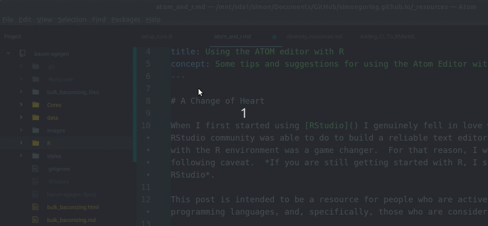

# A Change of Heart - RStudio to Atom

<div style="float:right;border-style:solid;padding:2mm;width:20%;text-align:center;">
  
  <div style="text-align:center;">The Atom IDE can be a powerful platform for coding!</div>
</div>

When I first started using [RStudio](https://www.rstudio.com/) I genuinely fell in love with R.  The work that the RStudio community was able to do to build a reliable text editor that was tightly coupled with the R environment was a game changer.  For that reason, I want to start with the following caveat.  _If you are still getting started with R, I strongly suggest using RStudio_.

This post is intended to be a resource for people who are actively using multiple programming languages, and, specifically, those who are considering using Atom.

My choice of Atom is related in part to a desire to always try figuring out new things, but also because I have been using more Markdown, SQL, JavaScript, more Cypher and more Python, along with my R development.  For this reason I wanted to try to find an editor that would allow me to work on multiple files, and workflows that integrated multiple file-types.  My first choice was Sublime Text.  I really enjoyed using SublimeText, but for various reasons, wound up discovering Atom and have gradually built my workflow around using it, rather than SublimeText.  I'm not really sure why honestly, so consider me agnostic with regards to Atom/SublimeText.

# Getting Started with ATOM

## Installation

The first step, installation, is fairly straightforward.  The [Atom Installation instructions](https://flight-manual.atom.io/getting-started/sections/installing-atom/) are well described.  The documentation is well written, in part (I suspect) because they have the resources and experience of the GitHub Team, who generally produce well written documentation for GitHub resources.

## Packages

Atom has a number of packages that can be installed through the Command Palette:



If you want to look at the range of packages you can go to the [Atom Packages webpage](<>).  On the Packages page you can see featured and trending packages, and search for packages you might be interested in.  The Command Palette also allows you to modify themes, to give yourself a dark theme so you can look like a hacker.

<blockquote class="twitter-tweet" data-lang="en"><p lang="en" dir="ltr">Real programmers:<br><br> ✔️ Men<br> ✔️ Women<br> ✔️ Frontend Devs<br> ✔️ Backend Devs<br> ❌ People who use light-themed IDEs or Editors</p>&mdash; Citizen Jane (@metaknerd) <a href="https://twitter.com/metaknerd/status/1001502675337297921?ref_src=twsrc%5Etfw">May 29, 2018</a></blockquote>
<script async src="https://platform.twitter.com/widgets.js" charset="utf-8"></script>

Regardless, since using Atom there are a few packages I've found invaluable:

-   [Atom Beautify](https://atom.io/packages/atom-beautify#beautify-a-specific-language): A package to automatically format code (including Markdown), with support for a number of languages, including R (using [Yihui Xie's `formatR` package](https://github.com/yihui/formatR)).
-   [Markdown Preview](https://atom.io/packages/markdown-preview): I do so much work in Markdown these days, as I develop my workflows, that having this tool built right into Atom is a real life-saver.
-   [Bracket Matcher](https://atom.io/packages/bracket-matcher): Honestly, do I need to explain why this is helpful?  Especially as I move from general-purpose code to specific workflows that can handle the nested `if`/`else` and `foo()`s that wind up cropping up to deal with edge cases, I find that a good bracket matcher is invaluable.
-   [atom-language-r](https://atom.io/packages/atom-language-r): Helps support R in Atom, including code highlighting.

## Getting Pipes with Keybindings

One of the things I missed the most about switching from `RStudio` to `Atom` was the fact that I couldn't use `CTRL-SHIFT-M` any more to get my beautiful `%>%` pipes.  I was resistant to pipes initially because I am always fighting my instinct to dislike anything new that I don't discover for myself (_Get off my lawn cool kids!_).

Atom has support for various keybindings, some of these can be simple (for example Atom uses `CTRL-N` for a new file, rather than RStudio's `CTRL-SHIFT-N`), but these keybindings can be customized.  Very quickly, to add support to the editor to allow pipes, you need to modify two files:

1.  Edit the `init.coffee` file:  To do this navigate to **Edit > Init Script...**  A file called `init.coffee` will open up.  This file interacts with the Atom API (a set of defined functions to interact with Atom) to generate user defined functions.  I wrote one that looks like this:

```coffee
atom.commands.add 'atom-text-editor', 'custom:piper', ->
  editor = atom.workspace.getActiveTextEditor()
  editor.insertText(' %>% ')
```

So, now, assocated with the text editor, there is a function we can refer to as `custom:piper`.  We'll use this to link `custom:piper` to the keybinding for `CRTL-SHIFT-M` now:

2.  Fix keybinding: Navigate to **Edit > Keymap...**.  A new window will open up.  Most of your attached packages have their own defined keymap bindings.  Here you will define custom bindings that are your own.  To do this, add the code:

```yaml
'atom-text-editor':
  'ctrl-shift-m': 'custom:piper'
```

Once you close and re-start Atom, you will have access to pipes using `ctrl-shift-m` and some other great tools through your packages.

Happy coding!
