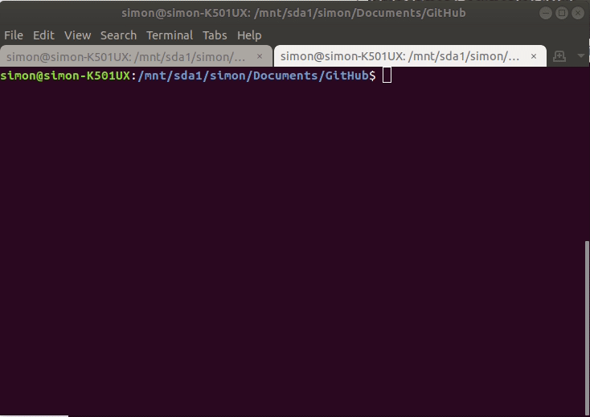

## Background

Currently I have over 80 active project directories in a folder that I use for most of my coding.  Some of these are active projects, some of these are project stubs that I started and then stopped working on, some of these reflect work I've done on collaborative projects that have finished.  The challenge for me is that it's not always clear where each project is. As part of my own personal goal to reduce the degree of clutter I'm facing, I decided to try to take control of the problem.

## What you'll learn


Hopefully in this resource you'll get a sense of:

  * how to manage elements of project management that are not directly related to one particular project, but rather a set of projects.
  * lean a bit about flow control (conditionals and loops) in `bash`
  * learn how to print in color to the terminal
  * learn how messy a person's project folders can get

This all sprang out of my own experience, so I hope it can be helpful to you.  The latest version of the bash script I will be talking about will be posted on my GitHub account in [a gist for managing projects with git](https://gist.github.com/SimonGoring/e024d857fbb406ed8cf37ae9b54c0d51).

### Project Management

I borrowed my project management file and directory structure largely from a post by Jenny Bryant that I am unable to find. The structure is mirrored in a [paper by Nobel on managing projects in Computational Biology](https://journals.plos.org/ploscompbiol/article?id=10.1371/journal.pcbi.1000424).  I choose to have a fairly standard project structure because I rely on R for much of my programming (although I've been using more of Python and node.js lately), but also because for most analytic workflows it makes a lot of intuitive sense.

Within each directory there is usually a `data` folder (with `input` and `output` folders), a `README.md`, `LICENSE` and `code_of_conduct.md` file (for most projects), some folder for auxillary code (like SQL or CQL code if needed), and then a folder for figures.  Regardless, because I am usually working on multiple projects at the same time, and have other constraints on my time, folders are often in various states of disrepair (or completion).  This leads to a situation where I have a large number of projects, many with un-committed changes, that can't easily be cleaned out of my working folders, nor pushed up to GitHub, because they are only partially complete.

To help make a shift in the way I work, to focus more on completing projects than on starting new things, I decided to start a new project.  A bash file that could check each directory and report its status, so that I can slowly check each of these off of my TODO list, and then push them up to GitHub and get them off of my laptop.

## Using bash


`bash` is a program that comes as part of Linux-based systems.  It provides command-line control, can pass and modify variables, do basic flow control (if/else and for loops), and execute other programs.

I want the bash file to start running in a directory (D<sub>0</sub>) and then check each sub-directory (d<sub>n</sub>) to see whether there is a `.git` directory (condition<sub>1</sub>: `.git` is absent: 0; `.git` is present: 1).  I should have git initialized for each directory because it is good practice, and tells me that I'm interested in managing this project sensibly.  If there is a `.git` directory, the next thing I want to do is test to see whether all files are committed (condition<sub>2</sub>: uncommitted files: 0; all files committed: 1).  This leads to three possible outcomes:

c<sub>1</sub> | c<sub>2</sub> | Result
------|-------|-------
0 | - | There's no `.git` folder!
1 | 0 | Some files are uncommitted.
1 | 1 | All files are committed.

Given the size of the parent project folder I want to be able to provide summary statistics as well, basically a running tally of each of these possible outcomes.  So, I want to report conditions `[0,-]` and `[1,0]` to the screen, and provide a tally of each class.

### Program workflow

I'll break down the code I wrote, but first, here's the program in its entirety:

```bash
#!/bin/bash
curdir=$PWD
RED='\033[0;31m'
NC='\033[0m' # No Color
cnt=0
good=0
untr=0
uncom=0

for D in */; do
  cnt=$((cnt+1))
  cd $D
  find -maxdepth 1 -name '\.git' -type d -print -quit | grep '\.git' &> /dev/null
    if [ $? == 0 ]; then
      if [ -z "$(git status --porcelain)" ]; then
        good=$((good+1))
      else
        printf "${RED}%-30s${NC} contains untracked (or uncommitted) files\n" $D
        uncom=$((uncom+1))
      fi
    else
      printf "${RED}%-30s${NC} is not currently tracked with git\n" $D
      untr=$((untr+1))
    fi
    cd $curdir
done

printf "You currently have:\n * %s clean project folders\n * %s tracked folders awaiting commits\n * %s untracked folders\n" $good $uncom $untr
```

### Setting variables

I set a number of variables at the top of the script.  These set the parent directory (the directory from which the bash script is called), assign color codes for printing later (the variables `RED` and `NC`), and then assign our counters.

Once these variables are assigned values we move through each directory using the `for D in */; do` statement.  This is a reserved statement in bash that tells the bash program to loop through each directory in the current directory, using `D` as the alias for that directory name.

#### Inside the loop

Inside the loop the script moves into directory `D`, incrementing the total `cntr` that keeps track of how many directories we currently have.  In the new directory I test condition<sub>1</sub> using `find`.  The statement:

```bash
find -maxdepth 1 -name '\.git' -type d -print -quit | grep '\.git' &> /dev/null
```

looks for a folder called `.git` in the current directory.  It doesn't look in any sub-folders because we set `-maxdepth` to 1, and it only looks at folders since we've set the `-type d`.  The `-print` flag tells `find` to print the folder name if it finds the folder, otherwise, with the `-quit` flag it will exit silently.  By piping (`|`) the output to the `grep` statement we can check to see if the output results in a positive hit (the error buffer, `$?` will be 0).  A lot happens in that little line, but basically it checks to see if `.git` is a folder.

If it is a folder (and `$?==0`) then we run `git status`.  The `-z` flag in the `if` statement checks to see if there is any output.  The `git status --porcelain` command returns nothing if all files are committed, otherwise it returns the status of untracked and uncommitted files:

```bash
$ git status --porcelain
M Baconizing_paper.Rmd
M R/lead_ages.R
?? Baconizing_paper_cache/
?? R/deprecated/
?? R/recalibrate_actual.R
?? figures/lead_binford_mod.svg
?? installLib.sh
?? short_bash.sh
```

If there was no output we would increment the `good` counter (`good=$((good+1))`), otherwise we would move to the `else`, print output to the screen (`printf "${RED}%-30s${NC} contains untracked (or uncommitted) files\n" $D`), and increment the counter for untracked changes (`uncom=$((uncom+1))`).


`printf` has some advantages over the simple `echo` statement.  For one, we can be a bit more explicit about how we actually format the output string.  Using the `${RED}` and `${NC}` variables defined at the top of the script we can color code our output.  `%s` is the standard formatting for including a variable in the `printf` statement, where the quoted text would be followed by the variable.  We see this again at the bottom of the script.  Here we add some more formatting instructions to the `%s` call.  By adding `-30` to `%-30s` we are telling `printf` to make the character block occupied by the variable (`$D`, our directory name) 30 characters long, and to pad with whitespace on the right.  This ensures that we get consistent alignment of both our directories (on the one side) and their associated messages.

Now that we've dealt with directories that contain `.git` folders, we close the `if/else/fi` conditional and report on the directories that don't have `.git` folders.  There's no need to test the `git status`, since we know that without a `.git` folder there's no `.git` tracking.

So, we can close out this `if/else/fi` conditional, we are still in the directory we're checking, so now we need to hop back out to our parent directory and get ready to move into the next project directory `$D` as we go back through the loop until we're finally `done`.

### At the end.

Once we're done we'll get something printed to the screen that looks a bit like this:

```
tac_earthcube/                 contains untracked (or uncommitted) files
teststaninstall/               is not currently tracked with git
throughputdb/                  contains untracked (or uncommitted) files
throughput-ec.github.io/       contains untracked (or uncommitted) files
tilia-api/                     contains untracked (or uncommitted) files
Workbooks/                     contains untracked (or uncommitted) files
workflow-paper/                is not currently tracked with git
```

This is nice, but I'd like to be able to get a quick summary of the results of this analysis, so I want to print out the final status of each counter:

```bash
printf "You currently have:\n * %s clean project folders\n * %s tracked folders awaiting commits\n * %s untracked folders\n" $good $uncom $untr
```

And there you go:

```
You currently have:
 * 21 clean project folders
 * 43 tracked folders awaiting commits
 * 17 untracked folders
```



## What you've learned

Hopefully in this resource you've:

   * obtained a handy tool to move through a set of project directories to check which directories need some attention to get them cleaned up and committed.
   * leaned a bit about flow control in bash
   * learned how to print in color to the terminal
   * learned how messy a person's project folders can get

You're welcome to help improve or update this bash file by commenting on [a live version of the file on the github gist](https://gist.github.com/SimonGoring/e024d857fbb406ed8cf37ae9b54c0d51) I've made for the checker.  Thanks for reading!
