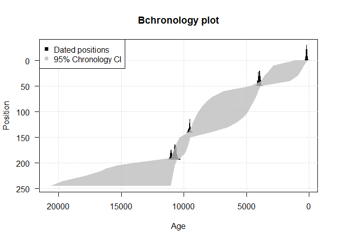

# Advanced Neotoma for Fun and Profit
Simon Goring  
October 6, 2016  


# What we'll learn

This document is intended to act as a more complete vignette of the `neotoma` package's functionality.  I'll show some functions & behaviour that's not neccessarily shown in the examples or the [*Open Quaternary* paper](http://www.openquaternary.com/articles/10.5334/oq.ab/).  Some of these examples are pretty straightforward, some are a bit more complicated.  I've made an effort to clearly comment code, but welcome any suggestions.  If you do have bug fixes, comments, or requests for additional examples, please let me know at [goring@wisc.edu]() or through the issues for [my website's GitHub repository](http://github.com/SimonGoring/simongoring.github.io/issues).

# Data Exploration Made Easy

It's a bit of a pain to download lots of records and then visualize them in R, or at least, it had been.  In building the package I wanted to try to limit the need to install lots of other packages, so the basic `plot()` method isn't all that helpful:


```r
library(neotoma)

# I'll try as much as I can to use the PACKAGE::FUNCTION() convention, although
# you don't need to use it.  Since this is a learning document I think it help
# make it a bit more explicit where these calls are coming from.

all_wi <- neotoma::get_dataset(gpid = "Wisconsin")
```

```
## The API call was successful, you have returned 501 records.
```

```r
plot(all_wi)
```


So, we can see the different dataset types. You can pretty much make out Wisconsin, but it doesn't look that great, and it's certainly not publication quality.  We can make a better map, an interactive map, using leaflet.  That's pretty fun, and the [RStudio help page for `leaflet`](https://rstudio.github.io/leaflet/) is really great to get you started.  Make sure the `leaflet` package is installed using `install.packages('leaflet')`, and then let's check out what we get:


```r
library(leaflet)

# We're going to use this multiple times I think, so let's make it a function:

leaflet_map <- function(dataset_in) {
  dataset_summary <- do.call(rbind, lapply(dataset_in, 
                        function(x){
                          # here we pull out the site information from the `dataset` objects:
                          data.frame(name = x$site.data$site.name,
                                     lat  = x$site.data$lat + runif(1, -0.005, 0.005),
                                     long = x$site.data$long + runif(1, -0.005, 0.005),
                                     type = x$dataset.meta$dataset.type)
                        }))
  
  # The leaflet package documentation uses piping.  For the sake of this tutorial, I won't.
  # First, define a color palette for the dataset type symbol plotting.
  pal <- colorFactor("Dark2", domain = levels(dataset_summary$type))
  
  # Now make the leaflet map, add base raster tiles and then add the markers for the records:
  map <- leaflet(data = dataset_summary)
  map <- leaflet::addTiles(map)
  map <- leaflet::addCircleMarkers(map, ~long, ~lat, 
                                   popup = ~paste0("Site: ", as.character(name), "<br>",
                                                   "Type: ", 
                                                   as.character(dataset_summary$type)),
                                   color = ~pal(type),
                                   stroke = FALSE, fillOpacity = 0.5)
  # You need to explicitly call the `map` object to make it appear!
  map
}

# Since that's all wrapped in a function, we can all it with any `dataset_list`:
leaflet_map(all_wi)
```

<!--html_preserve--><div id="htmlwidget-0ee6538d9cb08397d11d" style="width:672px;height:480px;" class="leaflet html-widget"></div>
<script type="application/json" data-for="htmlwidget-0ee6538d9cb08397d11d">{"x":{"calls":[{"method":"addTiles","args":["http://{s}.tile.openstreetmap.org/{z}/{x}/{y}.png",null,null,{"minZoom":0,"maxZoom":18,"maxNativeZoom":null,"tileSize":256,"subdomains":"abc","errorTileUrl":"","tms":false,"continuousWorld":false,"noWrap":false,"zoomOffset":0,"zoomReverse":false,"opacity":1,"zIndex":null,"unloadInvisibleTiles":null,"updateWhenIdle":null,"detectRetina":false,"reuseTiles":false,"attribution":"&copy; <a href=\"http://openstreetmap.org\">OpenStreetMap\u003c/a> contributors, <a href=\"http://creativecommons.org/licenses/by-sa/2.0/\">CC-BY-SA\u003c/a>"}]},{"method":"addCircleMarkers","args":[[42.7717435451294,43.6528840011358,43.5203038578248,43.6822458551615,43.5774865274713,43.3976233469299,42.6215817089984,42.6486418536655,42.7185975527368,43.7496260762191,43.6728163777781,42.8770712690218,42.7011420301674,43.103269459412,43.0819969869358,43.1742454537959,43.0345550636435,43.0828445795807,43.0296214321046,43.0759202294121,43.0471658670926,43.0701987963938,43.7214542406634,45.1985285354732,43.4155122865643,43.3333456847258,43.2791909479257,43.1466343803029,42.9289960201806,42.7990666998154,45.1520787848555,45.31758569706,45.4804817641526,45.6955835102988,46.0713744760351,46.3013125281897,46.0519929919369,46.5745687656314,46.5712212627218,46.5966841671732,46.3516922646156,46.1490307362494,46.0795098052802,46.1757476652344,46.248594894798,46.4821796916868,46.4228373176721,46.2843186308141,46.2676404568739,46.1505110004544,45.8961767653422,46.1506166544557,46.3531467564497,46.0509721960663,46.2196958755655,45.6335901492531,45.8199243933917,45.8965720108501,45.8306648833444,45.6048864491284,45.302569870057,43.60291366491,43.8657216542843,43.8549652405852,44.0713635136979,44.1462364564417,44.2848558633612,44.4239068550267,45.5678235865128,45.4190255606268,45.1308700736263,45.5656961868936,46.187681712794,46.2524241498974,44.4980869554007,43.0850874342647,45.7860585356847,45.9899455373375,45.2727023322089,45.847088068591,43.4160461018907,43.9166815286743,43.2344392653803,44.0533131274022,43.443554567602,44.5041867760802,45.3016356224613,44.2343392151447,45.2816609417432,45.2995557866176,43.102657669147,45.9362213558232,43.4013285498624,45.8844878202345,45.8622114289837,45.8458886669972,45.852627655908,45.8491145856353,45.831914906734,45.2841314860311,44.4472012505564,44.1482928168704,44.0870013681069,44.1526248727884,44.19792035233,44.3564518447773,44.5499051483748,44.584820286859,44.6005199391876,44.6388481735679,44.7041605184064,44.8228628120463,44.8829432067401,44.9321463367591,45.0772723099735,45.1200563139533,45.1433889459134,45.1995460612047,45.2962270273315,45.3972858013013,45.4246055720657,45.4998176018358,45.7978080597473,46.0420240336253,46.0050350199011,45.9989640375599,46.000221544134,45.8964138223161,46.0482581970156,46.0021177348448,45.8792993169701,45.9022740145912,45.856682504478,45.7799329765905,45.6990945687168,45.7017838266934,45.6142482566075,45.5740358993077,45.4899261188779,45.4389681979694,45.4550284498088,45.3794947904135,45.1640250862786,45.0456076573776,45.0533022943172,45.1833835215523,44.8856220441665,44.8911321463803,44.8053777215383,44.8060740112168,44.7964165005274,44.6874003451098,44.5708261212827,44.6037665596581,44.5474913097713,44.3708008923772,44.344578764421,44.346177345161,44.289116953293,44.1022635305207,43.9285634734965,43.5618985756353,43.2864040884763,43.1033706880454,42.9667249477218,43.0091582438714,42.9965477476316,43.003592717587,43.0953355936776,43.1044432004588,42.9267269729134,43.0015617677942,42.8826466621965,42.7789873339697,42.8978251396259,42.9987338138125,43.0782291916232,46.0165942625795,45.5247599105816,46.0007858320023,44.865809917436,44.8755731024151,44.9792336794501,44.8950452950969,44.8865634743986,44.8865131405182,45.0669116767054,45.0116907732934,44.8776807774859,45.0830147530138,44.9775022640754,45.0203126639314,44.9431097159116,44.9090644719382,45.0073331716307,44.9758505714987,44.9523788492289,45.1067797809374,45.0022643331508,44.8936372499727,44.888379012954,45.0866761380667,44.8724815357523,44.998468314514,45.2734211899253,45.0207743476401,45.0531309861783,45.0322706130403,44.888023079203,44.9041279820795,44.9766404973087,44.9915401060204,45.1046016139095,44.9296103986516,44.9772538313246,45.0104877543077,44.8685391644901,45.0891642384254,45.0612844508491,44.872603379467,44.8875227679894,45.1083764860197,45.0931222663727,44.9171714846022,45.0487208564114,44.9794405987649,44.9964307844336,44.8947494486743,44.9475218385248,45.0754036390805,45.108943825122,45.0497734257602,44.978550785163,45.0901276466949,45.0952311039134,44.8887884771987,45.0649079980119,45.0393423685711,44.9518353340961,45.0133320213668,45.0708890517545,45.0358451593923,45.0295647410117,45.3309355945065,46.1790784074896,43.9196832141614,46.1842589810764,45.2951018089149,46.2508103742171,43.0951857392141,44.4478235991951,45.3002138187853,45.8634918719769,43.4210356283092,44.8775364307151,44.8881487223157,44.8906045049336,44.870695189652,45.0022822038666,44.8758706932305,44.8823385394854,45.080745224955,45.1136021575099,44.9791010811902,44.9849872353207,45.0170797025436,44.8923019648367,45.0044541847752,44.8799529393413,45.000407994925,44.9258093863516,45.0264588645566,44.9800899508968,44.9090241290326,45.0904738004436,45.0586031299364,44.8831681243144,44.8752573999646,44.0020072888629,43.0044116667123,43.7995905001485,43.3693176454927,43.3530903864349,45.0203181818213,44.7524197271164,44.7511345665879,44.7523195255036,44.1365716997938,43.2547726536193,43.1138222555482,43.5031301678834,43.4992531924532,43.1138211543548,43.0300598879981,42.8685177009219,43.2883409744936,43.9126384106271,42.7482745417743,43.7493256744649,43.5042097712448,44.3689347615807,43.9190545797526,43.9159981207565,44.4683618141261,44.4658219033402,44.2643175551916,44.2671870348595,43.997555094976,43.7539621196035,43.2528312548646,44.1132694591108,43.0132273695494,43.0154404102188,42.7538831077586,42.9950667377538,45.3633486389757,42.9993651421252,43.615022947713,43.9987106108968,43.2500304231537,42.7486978648463,46.8644255518975,43.7502130289935,44.998507734735,45.4106619707485,43.7476088766451,43.7525564518874,43.7527751803771,43.7528154109721,43.7490812507202,43.7483303382574,44.3698922299795,44.362097359725,43.0850627078343,45.7830675933109,45.9874159378875,45.8509753997787,43.4224310197888,43.2294204144731,44.0503977439622,43.4433789672451,45.3030402095849,44.2417737552329,43.1048438725341,45.9295848673995,43.3955010911101,44.451550619693,44.1517561319843,45.3300703161344,43.9120828253667,45.2951029429794,46.2536477312935,43.0952050317754,45.3037204852654,42.998982325939,43.8042371800612,43.3484736579354,45.0126854928226,44.1362805368689,43.0352043264926,42.8700949852184,43.2866945055282,43.9207107306404,43.9151358445726,44.4640283098832,44.26427012487,44.2645300576153,43.2520382027188,43.0128330146607,46.8640406171178,43.0125171331448,46.3009771313368,46.3061523366965,46.3791515149069,46.3830062574623,45.1927947731733,45.1894469193251,45.9872542161224,45.9925330244782,45.3504709783489,45.3530270999054,45.2998141921637,45.2998733827401,45.7910201313622,45.7834960170552,46.3628899362262,46.3644485865858,43.8861301907518,43.8810251196235,44.6994410153211,44.6906603203423,43.6275278779383,43.6239588334768,44.2716680393212,44.2707480186696,43.415102543628,43.4212094314277,42.5098402719109,42.5068073969383,46.0294084574353,43.7994882234421,43.7972574682815,46.0875477917106,45.9292776542623,46.4037720015878,45.9579012886687,46.4975653185214,44.0476316930876,44.048692282232,46.0110215744255,46.0134327575746,46.5806200366014,46.5746376661154,43.2829190105773,43.2904696947142,44.3112490924331,44.311550222428,46.3980764969827,46.3969584496987,44.4445422988729,44.4511536366743,46.3052964747629,46.3080609143015,46.1160386856593,46.1216422344296,46.1236493051698,46.143397274286,46.1448333993493,46.1430167462988,42.7887868189391,42.7921735842617,45.5174891818103,45.5153889279997,44.9221547657589,44.9205127148179,45.1864254069344,45.188664233153,44.3288698848034,44.3236457086144,45.7625546254856,45.7636890600143,45.8717315596054,45.8760817652304,45.7377302028995,45.7378743524395,45.553514916755,45.5573702252705,45.4771605532248,45.475567161071,46.1068670362012,46.1068865125474,46.3108738445607,46.3090445869952,46.1546114682433,46.1487045733634,42.7845833448178,42.7881261560527,46.2977413373009,46.2941072516574,46.5873935099358,46.5874417513205,46.5868441223907,46.5828057205439,46.5724593889894,46.5646892659105,44.7577321048374,44.760655796946,42.8600256302572,42.8609490884157,43.9687039441413,43.9693686725602,45.9302385634189,45.9321690656017,45.9021927815922,45.9052375761829,42.8543994467348,42.8559899742148,42.9809129704735,42.9818413292468,43.803632761568,43.8041541414076,43.2857051474942,43.2857723783088,42.9971262386032,42.995944506173,43.7909016111433,43.7878816731307,43.9473605583218,43.9414514203818,43.5303074065798,43.5269553002731,43.193845084948,43.1942440635064,43.6104442823455,43.6154046140178,44.0308785252844,44.0328010649828,44.1082923995167,44.1145359265687,44.6354616672208,44.6331122495548],[-89.8715297276643,-90.9170726328017,-90.7791529438668,-90.7260609181412,-90.3754674395453,-90.4962572877109,-90.5803147214581,-90.6728700247244,-90.4673213971173,-91.4748242270877,-91.0485300360527,-89.8782209247281,-90.5471413032547,-89.9201185075915,-89.9154987523332,-89.7840610583872,-89.7987946597161,-89.8256034053536,-89.8726712481794,-89.8837847459526,-89.866749606079,-89.8500492972019,-90.3792691356037,-91.2839149239357,-87.9975993811968,-88.1980172391981,-88.3824030564446,-88.4295210200688,-88.0514556547161,-88.5534822597262,-88.1789340430009,-88.8024373464053,-88.1674523148174,-87.6249167109909,-87.832954268863,-87.5282771817851,-87.9688236387982,-88.2167478253506,-88.4487522668555,-88.8454542560177,-88.8774048039224,-88.8770300251222,-88.6177512026718,-89.0694967951951,-89.4219773175241,-89.9496966228308,-90.4034914059821,-90.5814465523278,-90.1654242448974,-89.9724475229275,-90.077633781156,-90.6292482642527,-91.347095644488,-91.7166597122164,-91.7998997712997,-91.5808889963082,-91.4691127327899,-90.9656736411666,-90.6235437071929,-90.2958861558139,-90.3163084786781,-88.2045964827063,-88.216003724637,-87.8690704420069,-87.7261267578183,-88.0671819341974,-87.7349840071728,-87.8682906720787,-89.6976202002028,-89.4771136959456,-90.6470619303826,-91.9980816102936,-89.6980583731085,-89.8951376139862,-89.4969926031143,-89.8706256346177,-89.4874673614506,-89.379557884573,-91.4741414426011,-89.3208839918353,-89.7328517036389,-89.1636544207771,-88.0449576936693,-87.7342328717275,-89.6662501471411,-89.1191178615283,-90.3519466861337,-87.8431387132817,-91.4805524523038,-91.4492685241764,-89.4210854604357,-89.6219307512767,-88.1000288573676,-88.4630336362106,-88.6299979749759,-88.4152975132019,-88.3658444603468,-88.3955906020571,-88.6633793214295,-91.4599674936332,-87.5204962788631,-91.4468076328142,-91.3496512618089,-91.7469089277593,-91.7010454964824,-91.4190774843962,-91.3940323495822,-92.0470538852009,-92.0262782544414,-91.9843929423979,-91.9983626173483,-91.4393744496204,-91.9334228116703,-91.8844753690442,-91.0763329640254,-91.3418809788822,-91.3930331082964,-91.999838497648,-91.3964477946446,-91.3181659888486,-91.4918306788034,-91.1020049021672,-89.6973357947869,-89.6663273648537,-89.7030311535889,-89.6955317947711,-89.6954627450556,-89.5003017527447,-89.1287426376133,-89.0002619972685,-88.2803034121677,-88.2026426962763,-88.1450012334654,-88.3357823482994,-88.3954824568634,-88.9997913544625,-89.3553551026983,-88.6840086274565,-89.0129351628069,-88.9482319888249,-89.2429104453638,-89.2505236880965,-88.9164758090797,-88.5188886336014,-89.0744387068654,-88.9883866126145,-89.2673379178922,-88.4825291708446,-88.4058458712377,-88.8692780205225,-88.8969908265094,-88.6578616220407,-88.9861737890387,-89.104926182637,-88.9251926663666,-88.9286722955284,-88.8650299813399,-89.374361890817,-89.1782970060534,-89.3013269799855,-89.2914103251849,-88.9163219667835,-89.651956411405,-90.000250823705,-90.4308465032737,-90.1036677014564,-89.998215633505,-89.8020209875703,-89.6951049070084,-89.4048283865349,-89.4471483804536,-89.298702887448,-89.2560746781532,-89.1754201048259,-88.9954863417288,-88.9960506549369,-88.9300113501499,-89.6299501816672,-91.2008807402686,-89.6220621028217,-88.5062952389289,-88.5200267335423,-88.8450552867679,-88.4929538334184,-88.5543124424829,-88.5987178071775,-88.7122698356747,-88.6954118298553,-88.6614075164567,-88.6284669970372,-88.5711176082352,-88.7479267251841,-88.5275074296468,-88.5766594797815,-88.8902152192779,-88.6268639709288,-88.6627569002658,-88.6248155643675,-88.5818674046942,-88.5674301812542,-88.5129297354282,-88.6972918897169,-88.7159014197346,-88.5499359981995,-88.5155672667478,-88.8334435924701,-88.6156237125653,-88.8191897606291,-88.627790900059,-88.5234732044628,-88.8855746089271,-88.5019261355093,-88.6078119784268,-88.5350011982303,-88.8441866042814,-88.7713414383167,-88.5000158559019,-88.5229057629872,-88.9609432561183,-88.7059450874943,-88.5411620493187,-88.5161485275999,-88.5125237548072,-88.6299220088427,-88.568779843899,-88.6393587350519,-88.7997210630588,-88.6226252861018,-88.5236005792813,-88.8447276050108,-88.881963432706,-88.9245120639238,-88.927678485096,-88.7795077012968,-88.5015951019037,-88.5550917272689,-88.7500287902285,-88.5186216354696,-88.5959794193366,-88.5495316453138,-88.7493974245922,-88.889576742826,-88.5081943853269,-90.088213919666,-89.695161471921,-89.1635481709413,-89.7010163625097,-90.3487003912264,-89.8969517681352,-89.4184602951194,-87.5184693628891,-91.4528454749612,-88.6358948592324,-89.7362525836627,-88.5191396053368,-88.6036525365128,-88.5964951530122,-88.5079320827918,-88.5822156301257,-88.659253650906,-88.6646227120957,-88.6312643390894,-88.6160181559972,-88.893604050912,-88.8908471530699,-88.8262796992133,-88.600465653881,-88.5847873184411,-88.6633910089848,-88.5525595676782,-88.5395095683821,-88.8154721979378,-88.5705240796949,-88.5842241639574,-88.7034189976589,-88.9613052352611,-88.5202174258186,-88.5240932344622,-88.495420288376,-88.919012895391,-89.2523421827471,-89.8680495503025,-89.9371141011881,-87.1500247394387,-87.3630759943618,-87.3714522083492,-87.3651904971168,-88.6799295953692,-90.5015624568635,-89.3629584796137,-89.0049264011881,-90.6195645652541,-90.6191407528815,-90.9477975401469,-89.8644878725886,-87.9770446346305,-91.2483000131161,-88.9975923555694,-91.1157549844581,-90.6169804055841,-91.9954706406756,-88.304802188566,-88.302267674976,-89.550267244766,-89.554275478546,-88.8495785662858,-88.8501186871017,-88.5017218643799,-91.1166573810476,-87.8624898351162,-88.3692103209502,-89.8519156701328,-89.8471578607965,-90.1163835365946,-89.1137382201517,-92.3671200767897,-87.9994399259798,-87.8700879900429,-89.3659648810342,-90.9973952406761,-90.6214693410524,-90.6119594754574,-91.115893122709,-87.1195663681456,-86.8301583852901,-91.1181749376088,-91.1131261438403,-91.1165775402558,-91.1198321514709,-91.1197291826402,-91.1132710059701,-91.5010787319206,-91.5040771677461,-89.8634124719683,-89.480906804853,-89.3770429673069,-89.3156910475792,-89.7276342072144,-88.0457914784256,-87.7313722191,-89.6678794985116,-90.3496434895252,-87.8504681192237,-89.4171241103188,-89.6285810503806,-88.1029510043981,-87.5145476242799,-91.4466539666406,-90.0789757740306,-89.1620951396957,-90.3474223339371,-89.8974574407889,-89.415217963453,-91.4455396292638,-88.9131257110337,-89.2541567875049,-89.9374159371558,-87.1508442712273,-88.6879514493685,-90.947628753311,-89.869908845673,-87.9722089654324,-91.2512323465105,-88.2975229664566,-89.5548922810052,-88.8471512235236,-88.8527280891082,-87.8684839362084,-89.8549929165188,-90.6190828079583,-89.845315673668,-91.163800976783,-91.1622140848255,-91.4956292497823,-91.4937760331775,-90.6037398659829,-90.6040174036818,-89.6254768026602,-89.6251026817812,-88.9091975525262,-88.9099918021619,-88.5504283289704,-88.5469321480649,-92.2229931387976,-92.2210248486693,-91.2556563615923,-91.250877152752,-89.2767176546858,-89.2736325412852,-91.0178987552409,-91.0203325948931,-88.1584815350938,-88.1592806238373,-89.1770632911371,-89.1687960964339,-89.7363078672105,-89.7351591750087,-88.2683499614107,-88.2732661589169,-89.6799045564319,-89.595113169024,-89.599259536375,-91.9408398388079,-92.2543559674607,-91.5268617506814,-92.1035961120914,-91.4059855410173,-87.7848280069231,-87.7833750351913,-92.1272255353886,-92.1218540261337,-91.3895017050499,-91.3927211943724,-89.6514743380625,-89.6529625275642,-89.2699711392714,-89.2714066200388,-90.2228587963146,-90.2158720346091,-87.5005925106208,-87.5011715379657,-91.1948823102829,-91.2004536409685,-92.0398436867389,-92.0408187763522,-92.0373297150749,-89.2564182273738,-89.255514171221,-89.2600965301247,-88.8471392621419,-88.8474241735314,-89.5588573867271,-89.5584192994076,-88.1591442371542,-88.1598541284362,-92.7169386025937,-92.7112955070519,-87.5463874086761,-87.5463661619066,-89.5891244779022,-89.5877522874607,-89.6534115472951,-89.6473612791046,-89.3295326017888,-89.326010789347,-88.7818320293263,-88.7778006632281,-88.6556920580629,-88.6543831249227,-89.9697082104859,-89.9694866801844,-91.2319382630756,-91.2322439953943,-91.343959599709,-91.3401205253311,-88.5529716172132,-88.5545689916837,-91.5232299278308,-91.5271275892555,-90.933016776908,-90.9312520815081,-91.3461148897752,-91.3454386188097,-91.4592303331589,-91.4521112793751,-89.4346617911298,-89.4388499521914,-88.3870649880907,-88.3954902238297,-90.7716520233276,-90.7666201285307,-92.3673006260395,-92.3690168027114,-92.2747571539176,-92.2725534953824,-88.3447034822509,-88.344262177454,-88.6098901846585,-88.6158223694259,-89.3563585128381,-89.3516166124983,-89.6581165174748,-89.6487125926143,-88.4610281620248,-88.4612098117968,-89.4454703862723,-89.4504801682211,-90.7963778075195,-90.7939381569709,-89.9281186267927,-89.9317412263069,-88.27238451588,-88.2707926679243,-88.1480349944284,-88.1424385352557,-89.2952747326619,-89.2982248116233,-89.3939986225731,-89.3890359626013,-91.9888177751937,-91.9901852433618],10,null,null,{"lineCap":null,"lineJoin":null,"clickable":true,"pointerEvents":null,"className":"","stroke":false,"color":["#1B9E77","#1B9E77","#1B9E77","#1B9E77","#1B9E77","#1B9E77","#1B9E77","#1B9E77","#1B9E77","#1B9E77","#1B9E77","#1B9E77","#1B9E77","#1B9E77","#1B9E77","#1B9E77","#1B9E77","#1B9E77","#1B9E77","#1B9E77","#1B9E77","#1B9E77","#1B9E77","#1B9E77","#1B9E77","#1B9E77","#1B9E77","#1B9E77","#1B9E77","#1B9E77","#1B9E77","#1B9E77","#1B9E77","#1B9E77","#1B9E77","#1B9E77","#1B9E77","#1B9E77","#1B9E77","#1B9E77","#1B9E77","#1B9E77","#1B9E77","#1B9E77","#1B9E77","#1B9E77","#1B9E77","#1B9E77","#1B9E77","#1B9E77","#1B9E77","#1B9E77","#1B9E77","#1B9E77","#1B9E77","#1B9E77","#1B9E77","#1B9E77","#1B9E77","#1B9E77","#1B9E77","#1B9E77","#1B9E77","#1B9E77","#1B9E77","#1B9E77","#1B9E77","#1B9E77","#1B9E77","#1B9E77","#1B9E77","#1B9E77","#1B9E77","#1B9E77","#1B9E77","#CB6B1B","#CB6B1B","#CB6B1B","#CB6B1B","#CB6B1B","#CB6B1B","#CB6B1B","#CB6B1B","#CB6B1B","#CB6B1B","#CB6B1B","#CB6B1B","#CB6B1B","#CB6B1B","#1B9E77","#CB6B1B","#CB6B1B","#CB6B1B","#1B9E77","#1B9E77","#1B9E77","#1B9E77","#1B9E77","#1B9E77","#CB6B1B","#CB6B1B","#CB6B1B","#1B9E77","#1B9E77","#1B9E77","#1B9E77","#1B9E77","#1B9E77","#1B9E77","#1B9E77","#1B9E77","#1B9E77","#1B9E77","#1B9E77","#1B9E77","#1B9E77","#1B9E77","#1B9E77","#1B9E77","#1B9E77","#1B9E77","#1B9E77","#1B9E77","#1B9E77","#1B9E77","#1B9E77","#1B9E77","#1B9E77","#1B9E77","#1B9E77","#1B9E77","#1B9E77","#1B9E77","#1B9E77","#1B9E77","#1B9E77","#1B9E77","#1B9E77","#1B9E77","#1B9E77","#1B9E77","#1B9E77","#1B9E77","#1B9E77","#1B9E77","#1B9E77","#1B9E77","#1B9E77","#1B9E77","#1B9E77","#1B9E77","#1B9E77","#1B9E77","#1B9E77","#1B9E77","#1B9E77","#1B9E77","#1B9E77","#1B9E77","#1B9E77","#1B9E77","#1B9E77","#1B9E77","#1B9E77","#1B9E77","#1B9E77","#1B9E77","#1B9E77","#1B9E77","#1B9E77","#1B9E77","#1B9E77","#1B9E77","#1B9E77","#1B9E77","#1B9E77","#1B9E77","#1B9E77","#1B9E77","#1B9E77","#1B9E77","#1B9E77","#1B9E77","#1B9E77","#1B9E77","#1B9E77","#1B9E77","#1B9E77","#1B9E77","#1B9E77","#1B9E77","#1B9E77","#1B9E77","#1B9E77","#1B9E77","#1B9E77","#1B9E77","#1B9E77","#1B9E77","#1B9E77","#1B9E77","#1B9E77","#1B9E77","#1B9E77","#1B9E77","#1B9E77","#1B9E77","#1B9E77","#1B9E77","#1B9E77","#1B9E77","#1B9E77","#1B9E77","#1B9E77","#1B9E77","#1B9E77","#1B9E77","#1B9E77","#1B9E77","#1B9E77","#1B9E77","#1B9E77","#1B9E77","#1B9E77","#1B9E77","#1B9E77","#1B9E77","#1B9E77","#1B9E77","#1B9E77","#1B9E77","#1B9E77","#1B9E77","#1B9E77","#1B9E77","#1B9E77","#1B9E77","#1B9E77","#1B9E77","#1B9E77","#1B9E77","#1B9E77","#1B9E77","#CB6B1B","#1B9E77","#CB6B1B","#CB6B1B","#CB6B1B","#CB6B1B","#CB6B1B","#CB6B1B","#CB6B1B","#1B9E77","#1B9E77","#1B9E77","#1B9E77","#1B9E77","#1B9E77","#1B9E77","#1B9E77","#1B9E77","#1B9E77","#1B9E77","#1B9E77","#1B9E77","#1B9E77","#1B9E77","#1B9E77","#1B9E77","#1B9E77","#1B9E77","#1B9E77","#1B9E77","#1B9E77","#1B9E77","#1B9E77","#1B9E77","#1B9E77","#9C6C8D","#9C6C8D","#9C6C8D","#9C6C8D","#9C6C8D","#9C6C8D","#9C6C8D","#9C6C8D","#9C6C8D","#9C6C8D","#9C6C8D","#9C6C8D","#9C6C8D","#9C6C8D","#9C6C8D","#9C6C8D","#9C6C8D","#9C6C8D","#9C6C8D","#9C6C8D","#9C6C8D","#9C6C8D","#9C6C8D","#9C6C8D","#9C6C8D","#9C6C8D","#9C6C8D","#9C6C8D","#9C6C8D","#9C6C8D","#9C6C8D","#9C6C8D","#9C6C8D","#9C6C8D","#9C6C8D","#9C6C8D","#9C6C8D","#9C6C8D","#9C6C8D","#9C6C8D","#9C6C8D","#9C6C8D","#9C6C8D","#9C6C8D","#9C6C8D","#9C6C8D","#9C6C8D","#9C6C8D","#9C6C8D","#9C6C8D","#9C6C8D","#9C6C8D","#9C6C8D","#9C6C8D","#9C6C8D","#C35199","#C35199","#C35199","#C35199","#C35199","#C35199","#C35199","#C35199","#C35199","#C35199","#C35199","#C35199","#C35199","#C35199","#C35199","#C35199","#C35199","#C35199","#C35199","#C35199","#C35199","#C35199","#C35199","#C35199","#C35199","#C35199","#C35199","#C35199","#C35199","#C35199","#C35199","#C35199","#C35199","#C35199","#C35199","#C35199","#C35199","#C35199","#C35199","#CB6B1B","#C35199","#CB6B1B","#C35199","#CB6B1B","#C35199","#CB6B1B","#B27D5D","#9BAA17","#B27D5D","#9BAA17","#C35199","#CB6B1B","#B27D5D","#9BAA17","#B27D5D","#9BAA17","#B27D5D","#9BAA17","#B27D5D","#9BAA17","#B27D5D","#9BAA17","#B27D5D","#9BAA17","#B27D5D","#9BAA17","#CB6B1B","#C35199","#CB6B1B","#CB6B1B","#CB6B1B","#CB6B1B","#CB6B1B","#CB6B1B","#B27D5D","#9BAA17","#C35199","#CB6B1B","#B27D5D","#9BAA17","#B27D5D","#9BAA17","#B27D5D","#9BAA17","#B27D5D","#9BAA17","#C35199","#D69D0F","#C35199","#CB6B1B","#C35199","#9F742A","#CB6B1B","#C35199","#9F742A","#CB6B1B","#C35199","#CB6B1B","#C35199","#CB6B1B","#C35199","#CB6B1B","#B27D5D","#666666","#C35199","#D69D0F","#B27D5D","#9BAA17","#B27D5D","#9BAA17","#B27D5D","#9BAA17","#B27D5D","#9BAA17","#B27D5D","#9BAA17","#B27D5D","#9BAA17","#B27D5D","#9BAA17","#B27D5D","#9BAA17","#B27D5D","#9BAA17","#B27D5D","#9BAA17","#B27D5D","#9BAA17","#B27D5D","#9BAA17","#B27D5D","#9BAA17","#C35199","#9C6C8D","#B27D5D","#9BAA17","#1B9E77","#1B9E77","#C35199","#CB6B1B","#C35199","#CB6B1B","#B27D5D","#9BAA17","#B27D5D","#9BAA17","#1B9E77","#1B9E77","#1B9E77","#1B9E77","#B27D5D","#9BAA17","#1B9E77","#1B9E77","#1B9E77","#1B9E77","#1B9E77","#1B9E77","#B27D5D","#9BAA17","#B27D5D","#9BAA17","#B27D5D","#9BAA17","#B27D5D","#9BAA17","#B27D5D","#9BAA17"],"weight":5,"opacity":0.5,"fill":true,"fillColor":["#1B9E77","#1B9E77","#1B9E77","#1B9E77","#1B9E77","#1B9E77","#1B9E77","#1B9E77","#1B9E77","#1B9E77","#1B9E77","#1B9E77","#1B9E77","#1B9E77","#1B9E77","#1B9E77","#1B9E77","#1B9E77","#1B9E77","#1B9E77","#1B9E77","#1B9E77","#1B9E77","#1B9E77","#1B9E77","#1B9E77","#1B9E77","#1B9E77","#1B9E77","#1B9E77","#1B9E77","#1B9E77","#1B9E77","#1B9E77","#1B9E77","#1B9E77","#1B9E77","#1B9E77","#1B9E77","#1B9E77","#1B9E77","#1B9E77","#1B9E77","#1B9E77","#1B9E77","#1B9E77","#1B9E77","#1B9E77","#1B9E77","#1B9E77","#1B9E77","#1B9E77","#1B9E77","#1B9E77","#1B9E77","#1B9E77","#1B9E77","#1B9E77","#1B9E77","#1B9E77","#1B9E77","#1B9E77","#1B9E77","#1B9E77","#1B9E77","#1B9E77","#1B9E77","#1B9E77","#1B9E77","#1B9E77","#1B9E77","#1B9E77","#1B9E77","#1B9E77","#1B9E77","#CB6B1B","#CB6B1B","#CB6B1B","#CB6B1B","#CB6B1B","#CB6B1B","#CB6B1B","#CB6B1B","#CB6B1B","#CB6B1B","#CB6B1B","#CB6B1B","#CB6B1B","#CB6B1B","#1B9E77","#CB6B1B","#CB6B1B","#CB6B1B","#1B9E77","#1B9E77","#1B9E77","#1B9E77","#1B9E77","#1B9E77","#CB6B1B","#CB6B1B","#CB6B1B","#1B9E77","#1B9E77","#1B9E77","#1B9E77","#1B9E77","#1B9E77","#1B9E77","#1B9E77","#1B9E77","#1B9E77","#1B9E77","#1B9E77","#1B9E77","#1B9E77","#1B9E77","#1B9E77","#1B9E77","#1B9E77","#1B9E77","#1B9E77","#1B9E77","#1B9E77","#1B9E77","#1B9E77","#1B9E77","#1B9E77","#1B9E77","#1B9E77","#1B9E77","#1B9E77","#1B9E77","#1B9E77","#1B9E77","#1B9E77","#1B9E77","#1B9E77","#1B9E77","#1B9E77","#1B9E77","#1B9E77","#1B9E77","#1B9E77","#1B9E77","#1B9E77","#1B9E77","#1B9E77","#1B9E77","#1B9E77","#1B9E77","#1B9E77","#1B9E77","#1B9E77","#1B9E77","#1B9E77","#1B9E77","#1B9E77","#1B9E77","#1B9E77","#1B9E77","#1B9E77","#1B9E77","#1B9E77","#1B9E77","#1B9E77","#1B9E77","#1B9E77","#1B9E77","#1B9E77","#1B9E77","#1B9E77","#1B9E77","#1B9E77","#1B9E77","#1B9E77","#1B9E77","#1B9E77","#1B9E77","#1B9E77","#1B9E77","#1B9E77","#1B9E77","#1B9E77","#1B9E77","#1B9E77","#1B9E77","#1B9E77","#1B9E77","#1B9E77","#1B9E77","#1B9E77","#1B9E77","#1B9E77","#1B9E77","#1B9E77","#1B9E77","#1B9E77","#1B9E77","#1B9E77","#1B9E77","#1B9E77","#1B9E77","#1B9E77","#1B9E77","#1B9E77","#1B9E77","#1B9E77","#1B9E77","#1B9E77","#1B9E77","#1B9E77","#1B9E77","#1B9E77","#1B9E77","#1B9E77","#1B9E77","#1B9E77","#1B9E77","#1B9E77","#1B9E77","#1B9E77","#1B9E77","#1B9E77","#1B9E77","#1B9E77","#1B9E77","#1B9E77","#1B9E77","#1B9E77","#1B9E77","#1B9E77","#1B9E77","#1B9E77","#1B9E77","#1B9E77","#1B9E77","#1B9E77","#1B9E77","#1B9E77","#1B9E77","#1B9E77","#1B9E77","#CB6B1B","#1B9E77","#CB6B1B","#CB6B1B","#CB6B1B","#CB6B1B","#CB6B1B","#CB6B1B","#CB6B1B","#1B9E77","#1B9E77","#1B9E77","#1B9E77","#1B9E77","#1B9E77","#1B9E77","#1B9E77","#1B9E77","#1B9E77","#1B9E77","#1B9E77","#1B9E77","#1B9E77","#1B9E77","#1B9E77","#1B9E77","#1B9E77","#1B9E77","#1B9E77","#1B9E77","#1B9E77","#1B9E77","#1B9E77","#1B9E77","#1B9E77","#9C6C8D","#9C6C8D","#9C6C8D","#9C6C8D","#9C6C8D","#9C6C8D","#9C6C8D","#9C6C8D","#9C6C8D","#9C6C8D","#9C6C8D","#9C6C8D","#9C6C8D","#9C6C8D","#9C6C8D","#9C6C8D","#9C6C8D","#9C6C8D","#9C6C8D","#9C6C8D","#9C6C8D","#9C6C8D","#9C6C8D","#9C6C8D","#9C6C8D","#9C6C8D","#9C6C8D","#9C6C8D","#9C6C8D","#9C6C8D","#9C6C8D","#9C6C8D","#9C6C8D","#9C6C8D","#9C6C8D","#9C6C8D","#9C6C8D","#9C6C8D","#9C6C8D","#9C6C8D","#9C6C8D","#9C6C8D","#9C6C8D","#9C6C8D","#9C6C8D","#9C6C8D","#9C6C8D","#9C6C8D","#9C6C8D","#9C6C8D","#9C6C8D","#9C6C8D","#9C6C8D","#9C6C8D","#9C6C8D","#C35199","#C35199","#C35199","#C35199","#C35199","#C35199","#C35199","#C35199","#C35199","#C35199","#C35199","#C35199","#C35199","#C35199","#C35199","#C35199","#C35199","#C35199","#C35199","#C35199","#C35199","#C35199","#C35199","#C35199","#C35199","#C35199","#C35199","#C35199","#C35199","#C35199","#C35199","#C35199","#C35199","#C35199","#C35199","#C35199","#C35199","#C35199","#C35199","#CB6B1B","#C35199","#CB6B1B","#C35199","#CB6B1B","#C35199","#CB6B1B","#B27D5D","#9BAA17","#B27D5D","#9BAA17","#C35199","#CB6B1B","#B27D5D","#9BAA17","#B27D5D","#9BAA17","#B27D5D","#9BAA17","#B27D5D","#9BAA17","#B27D5D","#9BAA17","#B27D5D","#9BAA17","#B27D5D","#9BAA17","#CB6B1B","#C35199","#CB6B1B","#CB6B1B","#CB6B1B","#CB6B1B","#CB6B1B","#CB6B1B","#B27D5D","#9BAA17","#C35199","#CB6B1B","#B27D5D","#9BAA17","#B27D5D","#9BAA17","#B27D5D","#9BAA17","#B27D5D","#9BAA17","#C35199","#D69D0F","#C35199","#CB6B1B","#C35199","#9F742A","#CB6B1B","#C35199","#9F742A","#CB6B1B","#C35199","#CB6B1B","#C35199","#CB6B1B","#C35199","#CB6B1B","#B27D5D","#666666","#C35199","#D69D0F","#B27D5D","#9BAA17","#B27D5D","#9BAA17","#B27D5D","#9BAA17","#B27D5D","#9BAA17","#B27D5D","#9BAA17","#B27D5D","#9BAA17","#B27D5D","#9BAA17","#B27D5D","#9BAA17","#B27D5D","#9BAA17","#B27D5D","#9BAA17","#B27D5D","#9BAA17","#B27D5D","#9BAA17","#B27D5D","#9BAA17","#C35199","#9C6C8D","#B27D5D","#9BAA17","#1B9E77","#1B9E77","#C35199","#CB6B1B","#C35199","#CB6B1B","#B27D5D","#9BAA17","#B27D5D","#9BAA17","#1B9E77","#1B9E77","#1B9E77","#1B9E77","#B27D5D","#9BAA17","#1B9E77","#1B9E77","#1B9E77","#1B9E77","#1B9E77","#1B9E77","#B27D5D","#9BAA17","#B27D5D","#9BAA17","#B27D5D","#9BAA17","#B27D5D","#9BAA17","#B27D5D","#9BAA17"],"fillOpacity":0.5,"dashArray":null},null,null,["Site: Blanch Road<br>Type: pollen surface sample","Site: Coon<br>Type: pollen surface sample","Site: Liberty<br>Type: pollen surface sample","Site: Clinton<br>Type: pollen surface sample","Site: Green WD<br>Type: pollen surface sample","Site: English River<br>Type: pollen surface sample","Site: Dickey Valley<br>Type: pollen surface sample","Site: Tennyson<br>Type: pollen surface sample","Site: Platte Valley<br>Type: pollen surface sample","Site: Hokah<br>Type: pollen surface sample","Site: Sheldon<br>Type: pollen surface sample","Site: Hollndal<br>Type: pollen surface sample","Site: Harrison<br>Type: pollen surface sample","Site: Arena8<br>Type: pollen surface sample","Site: Arena16<br>Type: pollen surface sample","Site: Mazomani<br>Type: pollen surface sample","Site: Vermnt29<br>Type: pollen surface sample","Site: Vermnt18<br>Type: pollen surface sample","Site: Brighm35<br>Type: pollen surface sample","Site: Arena15<br>Type: pollen surface sample","Site: Brighm25<br>Type: pollen surface sample","Site: Brighm24<br>Type: pollen surface sample","Site: Hillsbor<br>Type: pollen surface sample","Site: Site 1 (Swain unpublished)<br>Type: pollen surface sample","Site: Site 2 (Swain unpublished)<br>Type: pollen surface sample","Site: Site 3 (Swain unpublished)<br>Type: pollen surface sample","Site: Site 4 (Swain unpublished)<br>Type: pollen surface sample","Site: Site 5 (Swain unpublished)<br>Type: pollen surface sample","Site: Site 6 (Swain unpublished)<br>Type: pollen surface sample","Site: Site 7 (Swain unpublished)<br>Type: pollen surface sample","Site: Site 8 (Swain unpublished)<br>Type: pollen surface sample","Site: Site 9 (Swain unpublished)<br>Type: pollen surface sample","Site: Site 10 (Swain unpublished)<br>Type: pollen surface sample","Site: Site 11 (Swain unpublished)<br>Type: pollen surface sample","Site: Site 12 (Swain unpublished)<br>Type: pollen surface sample","Site: Site 13 (Swain unpublished)<br>Type: pollen surface sample","Site: Site 14 (Swain unpublished)<br>Type: pollen surface sample","Site: Site 15 (Swain unpublished)<br>Type: pollen surface sample","Site: Site 16 (Swain unpublished)<br>Type: pollen surface sample","Site: Site 17 (Swain unpublished)<br>Type: pollen surface sample","Site: Site 18 (Swain unpublished)<br>Type: pollen surface sample","Site: Site 19 (Swain unpublished)<br>Type: pollen surface sample","Site: Site 20 (Swain unpublished)<br>Type: pollen surface sample","Site: Site 21 (Swain unpublished)<br>Type: pollen surface sample","Site: Site 22 (Swain unpublished)<br>Type: pollen surface sample","Site: Site 23 (Swain unpublished)<br>Type: pollen surface sample","Site: Site 24 (Swain unpublished)<br>Type: pollen surface sample","Site: Site 25 (Swain unpublished)<br>Type: pollen surface sample","Site: Site 26 (Swain unpublished)<br>Type: pollen surface sample","Site: Site 27 (Swain unpublished)<br>Type: pollen surface sample","Site: Site 28 (Swain unpublished)<br>Type: pollen surface sample","Site: Site 29 (Swain unpublished)<br>Type: pollen surface sample","Site: Site 30 (Swain unpublished)<br>Type: pollen surface sample","Site: Site 31 (Swain unpublished)<br>Type: pollen surface sample","Site: Site 32 (Swain unpublished)<br>Type: pollen surface sample","Site: Site 33 (Swain unpublished)<br>Type: pollen surface sample","Site: Site 34 (Swain unpublished)<br>Type: pollen surface sample","Site: Site 35 (Swain unpublished)<br>Type: pollen surface sample","Site: Site 36 (Swain unpublished)<br>Type: pollen surface sample","Site: Site 37 (Swain unpublished)<br>Type: pollen surface sample","Site: Site 38 (Swain unpublished)<br>Type: pollen surface sample","Site: Site 39 (Swain unpublished)<br>Type: pollen surface sample","Site: Site 40 (Swain unpublished)<br>Type: pollen surface sample","Site: Site 41 (Swain unpublished)<br>Type: pollen surface sample","Site: Site 42 (Swain unpublished)<br>Type: pollen surface sample","Site: Site 43 (Swain unpublished)<br>Type: pollen surface sample","Site: Site 44 (Swain unpublished)<br>Type: pollen surface sample","Site: Site 45 (Swain unpublished)<br>Type: pollen surface sample","Site: Site 46 (Swain unpublished)<br>Type: pollen surface sample","Site: Site 47 (Swain unpublished)<br>Type: pollen surface sample","Site: Site 48 (Swain unpublished)<br>Type: pollen surface sample","Site: Site 49 (Swain unpublished)<br>Type: pollen surface sample","Site: Hell's Kitchen Lake<br>Type: pollen surface sample","Site: Lake Mary<br>Type: pollen surface sample","Site: Emily Lake<br>Type: pollen surface sample","Site: Blue Mounds Creek<br>Type: pollen","Site: Brown Lake<br>Type: pollen","Site: Camp 12 Lake<br>Type: pollen","Site: Dark Lake<br>Type: pollen","Site: Denton Lake<br>Type: pollen","Site: Devils Lake<br>Type: pollen","Site: Disterhaft Farm Bog<br>Type: pollen","Site: Ernst Brother's Pit<br>Type: pollen","Site: Gass Lake<br>Type: pollen","Site: Hansen Marsh<br>Type: pollen","Site: Iola Bog<br>Type: pollen","Site: Kellys Hollow<br>Type: pollen","Site: Kellners Lake<br>Type: pollen","Site: Little Pine Lake<br>Type: pollen","Site: Stewart's Dark Lake<br>Type: pollen surface sample","Site: Lake Mendota<br>Type: pollen","Site: Otto Mielke Lake<br>Type: pollen","Site: Radtke Lake<br>Type: pollen","Site: Savage Lake<br>Type: pollen surface sample","Site: Fay Lake<br>Type: pollen surface sample","Site: Patten Lake<br>Type: pollen surface sample","Site: No Name Lake<br>Type: pollen surface sample","Site: Price Lake<br>Type: pollen surface sample","Site: Long Lake<br>Type: pollen surface sample","Site: Ruby Lake<br>Type: pollen","Site: Seidel<br>Type: pollen","Site: Tamarack Creek<br>Type: pollen","Site: Marinuka<br>Type: pollen surface sample","Site: Merrick State Park<br>Type: pollen surface sample","Site: Haeusser Farm Pond<br>Type: pollen surface sample","Site: Bugle<br>Type: pollen surface sample","Site: Strum<br>Type: pollen surface sample","Site: Dead<br>Type: pollen surface sample","Site: Silver Birch<br>Type: pollen surface sample","Site: Thompson (US:Wisconsin)<br>Type: pollen surface sample","Site: Eau Galle<br>Type: pollen surface sample","Site: Altoona<br>Type: pollen surface sample","Site: Menomin<br>Type: pollen surface sample","Site: Tainter<br>Type: pollen surface sample","Site: Pike<br>Type: pollen surface sample","Site: Cornell<br>Type: pollen surface sample","Site: Marsh Miller<br>Type: pollen surface sample","Site: Friendly Pond<br>Type: pollen surface sample","Site: Island<br>Type: pollen surface sample","Site: Amacoy<br>Type: pollen surface sample","Site: Bass (WI1)<br>Type: pollen surface sample","Site: Park<br>Type: pollen surface sample","Site: Tomahawk<br>Type: pollen surface sample","Site: Trout<br>Type: pollen surface sample","Site: Sparkling<br>Type: pollen surface sample","Site: Weber<br>Type: pollen surface sample","Site: Helmet<br>Type: pollen surface sample","Site: Little St. Germain<br>Type: pollen surface sample","Site: South Twin<br>Type: pollen surface sample","Site: Kentuck<br>Type: pollen surface sample","Site: Emily<br>Type: pollen surface sample","Site: North (WI1)<br>Type: pollen surface sample","Site: Ellwood<br>Type: pollen surface sample","Site: West Bass<br>Type: pollen surface sample","Site: Hilbert<br>Type: pollen surface sample","Site: Pine (WI1)<br>Type: pollen surface sample","Site: Clear<br>Type: pollen surface sample","Site: Scattered Rice<br>Type: pollen surface sample","Site: Bishop<br>Type: pollen surface sample","Site: Rolling Stone<br>Type: pollen surface sample","Site: Enterprise<br>Type: pollen surface sample","Site: Duck<br>Type: pollen surface sample","Site: Mueller<br>Type: pollen surface sample","Site: Vejo<br>Type: pollen surface sample","Site: Meyer<br>Type: pollen surface sample","Site: Kolpack<br>Type: pollen surface sample","Site: Norrie<br>Type: pollen surface sample","Site: Berry<br>Type: pollen surface sample","Site: White Clay<br>Type: pollen surface sample","Site: Kroening<br>Type: pollen surface sample","Site: Bog Pond<br>Type: pollen surface sample","Site: Pine (WI2)<br>Type: pollen surface sample","Site: Twin<br>Type: pollen surface sample","Site: North (WI2)<br>Type: pollen surface sample","Site: School Section<br>Type: pollen surface sample","Site: White<br>Type: pollen surface sample","Site: Partridge Crop<br>Type: pollen surface sample","Site: Silver<br>Type: pollen surface sample","Site: Stratton<br>Type: pollen surface sample","Site: Wayside Pond<br>Type: pollen surface sample","Site: Tuttle<br>Type: pollen surface sample","Site: Fox<br>Type: pollen surface sample","Site: Fish Lake<br>Type: pollen surface sample","Site: Farm Pond<br>Type: pollen surface sample","Site: Montfort<br>Type: pollen surface sample","Site: Cox Hollow<br>Type: pollen surface sample","Site: Raemisch Farm Pond<br>Type: pollen surface sample","Site: Stewart<br>Type: pollen surface sample","Site: Weedy Farm Pond<br>Type: pollen surface sample","Site: Mendota<br>Type: pollen surface sample","Site: Harriet<br>Type: pollen surface sample","Site: Kegonsa<br>Type: pollen surface sample","Site: Bass (WI2)<br>Type: pollen surface sample","Site: Gibbs<br>Type: pollen surface sample","Site: Koshkonong<br>Type: pollen surface sample","Site: Ripley<br>Type: pollen surface sample","Site: Rock<br>Type: pollen surface sample","Site: Crystal Lake<br>Type: pollen surface sample","Site: Upper Bass Lake<br>Type: pollen surface sample","Site: Little John Lake<br>Type: pollen surface sample","Site: Menominee Site 1 (Webb unpublished)<br>Type: pollen surface sample","Site: Menominee Site 2 (Webb unpublished)<br>Type: pollen surface sample","Site: Menominee Site 3 (Webb unpublished)<br>Type: pollen surface sample","Site: Menominee Site 4 (Webb unpublished)<br>Type: pollen surface sample","Site: Menominee Site 5 (Webb unpublished)<br>Type: pollen surface sample","Site: Menominee Site 6 (Webb unpublished)<br>Type: pollen surface sample","Site: Menominee Site 7 (Webb unpublished)<br>Type: pollen surface sample","Site: Menominee Site 8 (Webb unpublished)<br>Type: pollen surface sample","Site: Menominee Site 9 (Webb unpublished)<br>Type: pollen surface sample","Site: Menominee Site 10 (Webb unpublished)<br>Type: pollen surface sample","Site: Menominee Site 11 (Webb unpublished)<br>Type: pollen surface sample","Site: Menominee Site 12 (Webb unpublished)<br>Type: pollen surface sample","Site: Menominee Site 13 (Webb unpublished)<br>Type: pollen surface sample","Site: Menominee Site 14 (Webb unpublished)<br>Type: pollen surface sample","Site: Menominee Site 15 (Webb unpublished)<br>Type: pollen surface sample","Site: Menominee Site 16 (Webb unpublished)<br>Type: pollen surface sample","Site: Menominee Site 17 (Webb unpublished)<br>Type: pollen surface sample","Site: Menominee Site 18 (Webb unpublished)<br>Type: pollen surface sample","Site: Menominee Site 19 (Webb unpublished)<br>Type: pollen surface sample","Site: Menominee Site 20 (Webb unpublished)<br>Type: pollen surface sample","Site: Menominee Site 21 (Webb unpublished)<br>Type: pollen surface sample","Site: Menominee Site 22 (Webb unpublished)<br>Type: pollen surface sample","Site: Menominee Site 23 (Webb unpublished)<br>Type: pollen surface sample","Site: Menominee Site 24 (Webb unpublished)<br>Type: pollen surface sample","Site: Menominee Site 25 (Webb unpublished)<br>Type: pollen surface sample","Site: Menominee Site 26 (Webb unpublished)<br>Type: pollen surface sample","Site: Menominee Site 27 (Webb unpublished)<br>Type: pollen surface sample","Site: Menominee Site 28 (Webb unpublished)<br>Type: pollen surface sample","Site: Menominee Site 29 (Webb unpublished)<br>Type: pollen surface sample","Site: Menominee Site 30 (Webb unpublished)<br>Type: pollen surface sample","Site: Menominee Site 31 (Webb unpublished)<br>Type: pollen surface sample","Site: Menominee Site 32 (Webb unpublished)<br>Type: pollen surface sample","Site: Menominee Site 33 (Webb unpublished)<br>Type: pollen surface sample","Site: Menominee Site 34 (Webb unpublished)<br>Type: pollen surface sample","Site: Menominee Site 35 (Webb unpublished)<br>Type: pollen surface sample","Site: Menominee Site 36 (Webb unpublished)<br>Type: pollen surface sample","Site: Menominee Site 37 (Webb unpublished)<br>Type: pollen surface sample","Site: Menominee Site 38 (Webb unpublished)<br>Type: pollen surface sample","Site: Menominee Site 39 (Webb unpublished)<br>Type: pollen surface sample","Site: Menominee Site 40 (Webb unpublished)<br>Type: pollen surface sample","Site: Menominee Site 41 (Webb unpublished)<br>Type: pollen surface sample","Site: Menominee Site 42 (Webb unpublished)<br>Type: pollen surface sample","Site: Menominee Site 43 (Webb unpublished)<br>Type: pollen surface sample","Site: Menominee Site 44 (Webb unpublished)<br>Type: pollen surface sample","Site: Menominee Site 45 (Webb unpublished)<br>Type: pollen surface sample","Site: Menominee Site 46 (Webb unpublished)<br>Type: pollen surface sample","Site: Menominee Site 47 (Webb unpublished)<br>Type: pollen surface sample","Site: Menominee Site 48 (Webb unpublished)<br>Type: pollen surface sample","Site: Menominee Site 49 (Webb unpublished)<br>Type: pollen surface sample","Site: Menominee Site 50 (Webb unpublished)<br>Type: pollen surface sample","Site: Menominee Site 51 (Webb unpublished)<br>Type: pollen surface sample","Site: Menominee Site 52 (Webb unpublished)<br>Type: pollen surface sample","Site: Menominee Site 53 (Webb unpublished)<br>Type: pollen surface sample","Site: Menominee Site 54 (Webb unpublished)<br>Type: pollen surface sample","Site: Menominee Site 55 (Webb unpublished)<br>Type: pollen surface sample","Site: Menominee Site 56 (Webb unpublished)<br>Type: pollen surface sample","Site: Menominee Site 57 (Webb unpublished)<br>Type: pollen surface sample","Site: Menominee Site 58 (Webb unpublished)<br>Type: pollen surface sample","Site: Menominee Site 59 (Webb unpublished)<br>Type: pollen surface sample","Site: Menominee Site 60 (Webb unpublished)<br>Type: pollen surface sample","Site: Menominee Site 61 (Webb unpublished)<br>Type: pollen surface sample","Site: Menominee Site 62 (Webb unpublished)<br>Type: pollen surface sample","Site: Menominee Site 63 (Webb unpublished)<br>Type: pollen surface sample","Site: Wood Lake<br>Type: pollen","Site: Hell's Kitchen Lake<br>Type: pollen surface sample","Site: Disterhaft Farm Bog<br>Type: pollen","Site: Hell's Kitchen Lake<br>Type: pollen","Site: Kellys Hollow<br>Type: pollen","Site: Lake Mary<br>Type: pollen","Site: Lake Mendota<br>Type: pollen","Site: Seidel<br>Type: pollen","Site: Stewart's Dark Lake<br>Type: pollen","Site: Fay Lake<br>Type: pollen surface sample","Site: Devils Lake<br>Type: pollen surface sample","Site: Menominee Site 2 (Webb unpublished)<br>Type: pollen surface sample","Site: Menominee Site 6 (Webb unpublished)<br>Type: pollen surface sample","Site: Menominee Site 6 (Webb unpublished)<br>Type: pollen surface sample","Site: Menominee Site 1 (Webb unpublished)<br>Type: pollen surface sample","Site: Menominee Site 19 (Webb unpublished)<br>Type: pollen surface sample","Site: Menominee Site 9 (Webb unpublished)<br>Type: pollen surface sample","Site: Menominee Site 9 (Webb unpublished)<br>Type: pollen surface sample","Site: Menominee Site 10 (Webb unpublished)<br>Type: pollen surface sample","Site: Menominee Site 18 (Webb unpublished)<br>Type: pollen surface sample","Site: Menominee Site 31 (Webb unpublished)<br>Type: pollen surface sample","Site: Menominee Site 31 (Webb unpublished)<br>Type: pollen surface sample","Site: Menominee Site 26 (Webb unpublished)<br>Type: pollen surface sample","Site: Menominee Site 6 (Webb unpublished)<br>Type: pollen surface sample","Site: Menominee Site 19 (Webb unpublished)<br>Type: pollen surface sample","Site: Menominee Site 9 (Webb unpublished)<br>Type: pollen surface sample","Site: Menominee Site 24 (Webb unpublished)<br>Type: pollen surface sample","Site: Menominee Site 34 (Webb unpublished)<br>Type: pollen surface sample","Site: Menominee Site 28 (Webb unpublished)<br>Type: pollen surface sample","Site: Menominee Site 11 (Webb unpublished)<br>Type: pollen surface sample","Site: Menominee Site 14 (Webb unpublished)<br>Type: pollen surface sample","Site: Menominee Site 22 (Webb unpublished)<br>Type: pollen surface sample","Site: Menominee Site 39 (Webb unpublished)<br>Type: pollen surface sample","Site: Menominee Site 2 (Webb unpublished)<br>Type: pollen surface sample","Site: Menominee Site 2 (Webb unpublished)<br>Type: pollen surface sample","Site: Bell [Wn9]<br>Type: vertebrate fauna","Site: Aztalan<br>Type: vertebrate fauna","Site: Bornick [47MQ65]<br>Type: vertebrate fauna","Site: Durst [SK2]<br>Type: vertebrate fauna","Site: Raddatz Rockshelter [SK5]<br>Type: vertebrate fauna","Site: Heins Creek<br>Type: vertebrate fauna","Site: Mero<br>Type: vertebrate fauna","Site: Mero<br>Type: vertebrate fauna","Site: Mero<br>Type: vertebrate fauna","Site: Lasley's Point<br>Type: vertebrate fauna","Site: Boaz Mastodon<br>Type: vertebrate fauna","Site: Dietz [47Da12]<br>Type: vertebrate fauna","Site: Walker-Hooper [47GL65]<br>Type: vertebrate fauna","Site: Rose II Rockshelter [47Ve146]<br>Type: vertebrate fauna","Site: Castle Rock Cave<br>Type: vertebrate fauna","Site: Millville [47GT53]<br>Type: vertebrate fauna","Site: Moscow Fissure<br>Type: vertebrate fauna","Site: Hilgen Spring Park<br>Type: vertebrate fauna","Site: Midway [47LC19]<br>Type: vertebrate fauna","Site: Cooper's Shore [47RO2]<br>Type: vertebrate fauna","Site: Overhead [47LC20]<br>Type: vertebrate fauna","Site: Rehbein I [47RI81]<br>Type: vertebrate fauna","Site: Armstrong [47PE12]<br>Type: vertebrate fauna","Site: Pipe Site [47FD10]<br>Type: vertebrate fauna","Site: Bluff Siding [47BF45]<br>Type: vertebrate fauna","Site: Bigelow II [47PT29-2]<br>Type: vertebrate fauna","Site: Bigelow I [47PT29-1]<br>Type: vertebrate fauna","Site: Sanders III [47WP70]<br>Type: vertebrate fauna","Site: Sanders I [47WP26]<br>Type: vertebrate fauna","Site: Nile Roeder [47WN97]<br>Type: vertebrate fauna","Site: Pammel Creek [47LC61]<br>Type: vertebrate fauna","Site: Klug [47OZ26]<br>Type: vertebrate fauna","Site: Furman [47WN216]<br>Type: vertebrate fauna","Site: Lost River Sink<br>Type: vertebrate fauna","Site: Lost River Sink<br>Type: vertebrate fauna","Site: Shoemaker Shop<br>Type: vertebrate fauna","Site: Witte Farm [UWZP-20001]<br>Type: vertebrate fauna","Site: Interstate Park<br>Type: vertebrate fauna","Site: Wauwatosa Caribou [MPM-VP-858]<br>Type: vertebrate fauna","Site: Oostburg Caribou [MPM-VP-902]<br>Type: vertebrate fauna","Site: Zelienka Caribou<br>Type: vertebrate fauna","Site: Mill Pond [47CR186]<br>Type: vertebrate fauna","Site: Preston Rockshelter [47GT157]<br>Type: vertebrate fauna","Site: P-Flat [47AS47]<br>Type: vertebrate fauna","Site: State Road Coulee [47LC176]<br>Type: vertebrate fauna","Site: Whitefish Dunes [47DR167]<br>Type: vertebrate fauna","Site: Rock Island<br>Type: vertebrate fauna","Site: 47LC45<br>Type: vertebrate fauna","Site: 47LC44<br>Type: vertebrate fauna","Site: 47LC43<br>Type: vertebrate fauna","Site: Sand Lake<br>Type: vertebrate fauna","Site: Tremaine [47LC95]<br>Type: vertebrate fauna","Site: 47LC185<br>Type: vertebrate fauna","Site: Rud I<br>Type: vertebrate fauna","Site: Rud II<br>Type: vertebrate fauna","Site: Blue Mounds Creek<br>Type: geochronologic","Site: Brown Lake<br>Type: geochronologic","Site: Camp 12 Lake<br>Type: geochronologic","Site: Denton Lake<br>Type: geochronologic","Site: Devils Lake<br>Type: geochronologic","Site: Ernst Brother's Pit<br>Type: geochronologic","Site: Gass Lake<br>Type: geochronologic","Site: Hansen Marsh<br>Type: geochronologic","Site: Kellys Hollow<br>Type: geochronologic","Site: Kellners Lake<br>Type: geochronologic","Site: Lake Mendota<br>Type: geochronologic","Site: Otto Mielke Lake<br>Type: geochronologic","Site: Radtke Lake<br>Type: geochronologic","Site: Seidel<br>Type: geochronologic","Site: Tamarack Creek<br>Type: geochronologic","Site: Wood Lake<br>Type: geochronologic","Site: Disterhaft Farm Bog<br>Type: geochronologic","Site: Kellys Hollow<br>Type: geochronologic","Site: Lake Mary<br>Type: geochronologic","Site: Lake Mendota<br>Type: geochronologic","Site: Stewart's Dark Lake<br>Type: geochronologic","Site: Aztalan<br>Type: geochronologic","Site: Bornick [47MQ65]<br>Type: geochronologic","Site: Raddatz Rockshelter [SK5]<br>Type: geochronologic","Site: Heins Creek<br>Type: geochronologic","Site: Lasley's Point<br>Type: geochronologic","Site: Millville [47GT53]<br>Type: geochronologic","Site: Moscow Fissure<br>Type: geochronologic","Site: Hilgen Spring Park<br>Type: geochronologic","Site: Midway [47LC19]<br>Type: geochronologic","Site: Pipe Site [47FD10]<br>Type: geochronologic","Site: Bigelow I [47PT29-1]<br>Type: geochronologic","Site: Sanders III [47WP70]<br>Type: geochronologic","Site: Sanders I [47WP26]<br>Type: geochronologic","Site: Klug [47OZ26]<br>Type: geochronologic","Site: Lost River Sink<br>Type: geochronologic","Site: P-Flat [47AS47]<br>Type: geochronologic","Site: Lost River Sink<br>Type: geochronologic","Site: Adeline Lake<br>Type: geochronologic","Site: Adeline Lake<br>Type: pollen","Site: Elevenses Lake<br>Type: geochronologic","Site: Elevenses Lake<br>Type: pollen","Site: Eska Lake<br>Type: geochronologic","Site: Eska Lake<br>Type: pollen","Site: Fallison Lake<br>Type: geochronologic","Site: Fallison Lake<br>Type: pollen","Site: Big Twin Lake<br>Type: water chemistry","Site: Big Twin Lake<br>Type: ostracode surface sample","Site: Chain Lake<br>Type: water chemistry","Site: Chain Lake<br>Type: ostracode surface sample","Site: Hell Hole Lake<br>Type: geochronologic","Site: Hell Hole Lake<br>Type: pollen","Site: Cisco Lake<br>Type: water chemistry","Site: Cisco Lake<br>Type: ostracode surface sample","Site: Comstock Lake<br>Type: water chemistry","Site: Comstock Lake<br>Type: ostracode surface sample","Site: Coon Fork Lake<br>Type: water chemistry","Site: Coon Fork Lake<br>Type: ostracode surface sample","Site: Crooked Lake<br>Type: water chemistry","Site: Crooked Lake<br>Type: ostracode surface sample","Site: Crystal Lake<br>Type: water chemistry","Site: Crystal Lake<br>Type: ostracode surface sample","Site: Devils Lake<br>Type: water chemistry","Site: Devils Lake<br>Type: ostracode surface sample","Site: Elizabeth Lake<br>Type: water chemistry","Site: Elizabeth Lake<br>Type: ostracode surface sample","Site: Trout Lake<br>Type: pollen","Site: Emrick Lake<br>Type: geochronologic","Site: Emrick Lake<br>Type: pollen","Site: Adventure Lake<br>Type: pollen","Site: Benach Lake<br>Type: pollen","Site: BlueJ Lake<br>Type: pollen","Site: Brozie Lake<br>Type: pollen","Site: Camp Two Lake<br>Type: pollen","Site: English Lake<br>Type: water chemistry","Site: English Lake<br>Type: ostracode surface sample","Site: Ferry Lake<br>Type: geochronologic","Site: Ferry Lake<br>Type: pollen","Site: Fire Lake<br>Type: water chemistry","Site: Fire Lake<br>Type: ostracode surface sample","Site: Fish Lake<br>Type: water chemistry","Site: Fish Lake<br>Type: ostracode surface sample","Site: Fountain Lake<br>Type: water chemistry","Site: Fountain Lake<br>Type: ostracode surface sample","Site: Gile Flowage Lake<br>Type: water chemistry","Site: Gile Flowage Lake<br>Type: ostracode surface sample","Site: Kewaunee<br>Type: geochronologic","Site: Kewaunee<br>Type: insect","Site: Hemlock Lake<br>Type: geochronologic","Site: Hemlock Lake<br>Type: pollen","Site: Warner Lake<br>Type: geochronologic","Site: Warner Lake<br>Type: plant macrofossil","Site: Warner Lake<br>Type: pollen","Site: Lake O' Pines<br>Type: geochronologic","Site: Lake O' Pines<br>Type: plant macrofossil","Site: Lake O' Pines<br>Type: pollen","Site: Lima Bog<br>Type: geochronologic","Site: Lima Bog<br>Type: pollen","Site: Capitola Lake<br>Type: geochronologic","Site: Capitola Lake<br>Type: pollen","Site: Beaver Lake<br>Type: geochronologic","Site: Beaver Lake<br>Type: pollen","Site: Pine Lake<br>Type: water chemistry","Site: Pine Lake<br>Type: diatom surface sample","Site: Two Creeks Forest Bed<br>Type: geochronologic","Site: Two Creeks Forest Bed<br>Type: insect","Site: Hawk Lake<br>Type: water chemistry","Site: Hawk Lake<br>Type: ostracode surface sample","Site: Hemlock Lake<br>Type: water chemistry","Site: Hemlock Lake<br>Type: ostracode surface sample","Site: Jennie Webber Lake<br>Type: water chemistry","Site: Jennie Webber Lake<br>Type: ostracode surface sample","Site: Wabikon Lake<br>Type: water chemistry","Site: Wabikon Lake<br>Type: ostracode surface sample","Site: Trump Lake<br>Type: water chemistry","Site: Trump Lake<br>Type: ostracode surface sample","Site: Sandy Beach Lake<br>Type: water chemistry","Site: Sandy Beach Lake<br>Type: ostracode surface sample","Site: Roger Lake<br>Type: water chemistry","Site: Roger Lake<br>Type: ostracode surface sample","Site: Pacwawong Lake<br>Type: water chemistry","Site: Pacwawong Lake<br>Type: ostracode surface sample","Site: Pleasant Lake<br>Type: water chemistry","Site: Pleasant Lake<br>Type: ostracode surface sample","Site: Middle Eau Claire Lake<br>Type: water chemistry","Site: Middle Eau Claire Lake<br>Type: ostracode surface sample","Site: Lake Superior Marsh<br>Type: water chemistry","Site: Lake Superior Marsh<br>Type: ostracode surface sample","Site: Long Lake<br>Type: water chemistry","Site: Long Lake<br>Type: ostracode surface sample","Site: Spring Lake<br>Type: water chemistry","Site: Spring Lake<br>Type: ostracode surface sample","Site: Kluck Farm<br>Type: geochronologic","Site: Kluck Farm<br>Type: vertebrate fauna","Site: Roxy Pond [Mukwonago Pond]<br>Type: water chemistry","Site: Roxy Pond [Mukwonago Pond]<br>Type: ostracode surface sample","Site: Angelo<br>Type: pollen surface sample","Site: Angelo<br>Type: pollen surface sample","Site: Lone Star Lake<br>Type: geochronologic","Site: Lone Star Lake<br>Type: pollen","Site: Lily Lake<br>Type: geochronologic","Site: Lily Lake<br>Type: pollen","Site: Lower Phantom Lake<br>Type: water chemistry","Site: Lower Phantom Lake<br>Type: ostracode surface sample","Site: Rome Pond [Rome Mill Pond]<br>Type: water chemistry","Site: Rome Pond [Rome Mill Pond]<br>Type: ostracode surface sample","Site: Kilby<br>Type: pollen surface sample","Site: Kilby<br>Type: pollen surface sample","Site: Fish Lake<br>Type: pollen surface sample","Site: Fish Lake<br>Type: pollen surface sample","Site: Hunters Lake<br>Type: water chemistry","Site: Hunters Lake<br>Type: ostracode surface sample","Site: Emery<br>Type: pollen surface sample","Site: Emery<br>Type: pollen surface sample","Site: Perch Lake<br>Type: pollen surface sample","Site: Perch Lake<br>Type: pollen surface sample","Site: Lake Virginia<br>Type: pollen surface sample","Site: Lake Virginia<br>Type: pollen surface sample","Site: Lake Five<br>Type: water chemistry","Site: Lake Five<br>Type: ostracode surface sample","Site: Lake Seven<br>Type: water chemistry","Site: Lake Seven<br>Type: ostracode surface sample","Site: Meilke Lake<br>Type: water chemistry","Site: Meilke Lake<br>Type: ostracode surface sample","Site: Marl Lake<br>Type: water chemistry","Site: Marl Lake<br>Type: ostracode surface sample","Site: Thompson Lake<br>Type: water chemistry","Site: Thompson Lake<br>Type: ostracode surface sample"]]}],"limits":{"lat":[42.5068073969383,46.8644255518975],"lng":[-92.7169386025937,-86.8301583852901]}},"evals":[],"jsHooks":[]}</script><!--/html_preserve-->

This is much nicer (I think), but it is still missing all the additional information that goes along with a Neotoma record.  We can go directly to the Neotoma Explorer using the `browse` function.  Unfortunately, because of the limitations of URL string length, this doesn't always work:

```r
# Does not work:
neotoma::browse(all_wi)

# Does work:
some_wi <- neotoma::get_dataset(gpid = "Wisconsin", datasettype = "pollen")
neotoma::browse(some_wi)

```

Yay! (A browser window should have opened with your datasets in it).

## Plotting stratigraphic diagrams

Let's say we're looking for all records from Wisconsin with *Larix* pollen, that must have some samples within the middle Holocene:


```r
some_wi <- neotoma::get_dataset(gpid = "Wisconsin", datasettype = "pollen", taxonname = "Larix%", ageyoung = 4000, ageold = 6000)
```

```
## The API call was successful, you have returned 18 records.
```

```r
wi_pollen <- neotoma::get_download(some_wi, verbose = FALSE)
```

```
## Warning: 
## There were multiple entries for Eucalyptus tablets 
## get_download has mapped aliases for the taxa in the taxon.list.

## Warning: 
## There were multiple entries for Eucalyptus tablets 
## get_download has mapped aliases for the taxa in the taxon.list.
```

```r
leaflet_map(some_wi) # This is the function we made above.
```

<!--html_preserve--><div id="htmlwidget-85199f132640c94d520c" style="width:672px;height:480px;" class="leaflet html-widget"></div>
<script type="application/json" data-for="htmlwidget-85199f132640c94d520c">{"x":{"calls":[{"method":"addTiles","args":["http://{s}.tile.openstreetmap.org/{z}/{x}/{y}.png",null,null,{"minZoom":0,"maxZoom":18,"maxNativeZoom":null,"tileSize":256,"subdomains":"abc","errorTileUrl":"","tms":false,"continuousWorld":false,"noWrap":false,"zoomOffset":0,"zoomReverse":false,"opacity":1,"zIndex":null,"unloadInvisibleTiles":null,"updateWhenIdle":null,"detectRetina":false,"reuseTiles":false,"attribution":"&copy; <a href=\"http://openstreetmap.org\">OpenStreetMap\u003c/a> contributors, <a href=\"http://creativecommons.org/licenses/by-sa/2.0/\">CC-BY-SA\u003c/a>"}]},{"method":"addCircleMarkers","args":[[46.2455703068362,43.4160717197901,43.9180664048049,44.05011936286,45.3031850898755,45.3002228139969,44.2393004025138,45.2964944539312,43.4028875407344,44.4482103472133,44.1506564699556,45.3380919402017,43.7956401964791,46.3029119570741,46.1403487870804,42.7855067602031,45.5222991702052,44.9197572900646],[-89.8959910647851,-89.731505479274,-89.1650551333496,-87.7324243566947,-90.3538374279533,-90.3539887575596,-87.8522829968824,-91.4524647011329,-88.1019765015598,-87.5200797362082,-91.4512316938583,-90.0876568619505,-89.5982257585197,-91.2024764943597,-89.2540125316472,-88.8427095640887,-89.5507314698563,-88.161895063567],10,null,null,{"lineCap":null,"lineJoin":null,"clickable":true,"pointerEvents":null,"className":"","stroke":false,"color":["#B27D5D","#B27D5D","#B27D5D","#B27D5D","#B27D5D","#B27D5D","#B27D5D","#B27D5D","#B27D5D","#B27D5D","#B27D5D","#B27D5D","#B27D5D","#B27D5D","#B27D5D","#B27D5D","#B27D5D","#B27D5D"],"weight":5,"opacity":0.5,"fill":true,"fillColor":["#B27D5D","#B27D5D","#B27D5D","#B27D5D","#B27D5D","#B27D5D","#B27D5D","#B27D5D","#B27D5D","#B27D5D","#B27D5D","#B27D5D","#B27D5D","#B27D5D","#B27D5D","#B27D5D","#B27D5D","#B27D5D"],"fillOpacity":0.5,"dashArray":null},null,null,["Site: Lake Mary<br>Type: pollen","Site: Devils Lake<br>Type: pollen","Site: Disterhaft Farm Bog<br>Type: pollen","Site: Gass Lake<br>Type: pollen","Site: Kellys Hollow<br>Type: pollen","Site: Kellys Hollow<br>Type: pollen","Site: Kellners Lake<br>Type: pollen","Site: Stewart's Dark Lake<br>Type: pollen","Site: Radtke Lake<br>Type: pollen","Site: Seidel<br>Type: pollen","Site: Tamarack Creek<br>Type: pollen","Site: Wood Lake<br>Type: pollen","Site: Emrick Lake<br>Type: pollen","Site: Hemlock Lake<br>Type: pollen","Site: Lake O' Pines<br>Type: pollen","Site: Lima Bog<br>Type: pollen","Site: Capitola Lake<br>Type: pollen","Site: Beaver Lake<br>Type: pollen"]]}],"limits":{"lat":[42.7855067602031,46.3029119570741],"lng":[-91.4524647011329,-87.5200797362082]}},"evals":[],"jsHooks":[]}</script><!--/html_preserve-->

What do these records look like?


```r
wi_pollen
```

```
## A download_list containing 18 objects:
## Accessed from 2016-10-13 17:27h to 2016-10-13 17:27h. 
## Datasets:
##  dataset.id           site.name      long      lat age.younger age.older
##        3473 Lake Mary           -89.90000 46.25000         200     10345
##         684 Devils Lake         -89.73205 43.41780           0     13614
##         700 Disterhaft Farm Bog -89.16694 43.91694         699     13840
##         860 Gass Lake           -87.73333 44.05000           0     15612
##        1447 Kellys Hollow       -90.35000 45.30000         -29     10000
##        3452 Kellys Hollow       -90.35000 45.30000         -29     10730
##        1448 Kellners Lake       -87.84806 44.23806         -23     14094
##        3781 Stewart's Dark Lake -91.45000 45.30000         482     10649
##        2011 Radtke Lake         -88.10000 43.40000           0     11483
##        3620 Seidel              -87.51556 44.45000          32     11227
##        2624 Tamarack Creek      -91.45000 44.15000           0      4500
##        3035 Wood Lake           -90.08333 45.33333           0     13101
##       15302 Emrick Lake         -89.59428 43.80016         -57     11878
##       15740 Hemlock Lake        -91.19829 46.30730         -42     10877
##       15925 Lake O' Pines       -89.25530 46.14043         -47     12854
##       16129 Lima Bog            -88.84320 42.78895         -31     18406
##       17304 Capitola Lake       -89.55507 45.51958         -40     13288
##       17387 Beaver Lake         -88.15694 44.91960         -30      5103
##    type
##  pollen
##  pollen
##  pollen
##  pollen
##  pollen
##  pollen
##  pollen
##  pollen
##  pollen
##  pollen
##  pollen
##  pollen
##  pollen
##  pollen
##  pollen
##  pollen
##  pollen
##  pollen
```

I like Devil's Lake, so let's take a look at the pollen.  To get this to work you need the `analogue` package:


```r
library(analogue, quietly = TRUE)

Stratiplot(wi_pollen[[2]])
```

<!-- -->

You have all the advantages of the `Stratiplot()` function now, and the wrapper for the `neotoma` package makes it more useful directly with `download` objects.

## Re-building Age-Models

So, I'm interested in the smoothed surface of *Larix* pollen at 4kyr in the region.  I'm going to do a lazy job of it, but that's my perogative.  I just want you to see what we might do.

First, we know there are different age types in the records.  Let's see what we've got here:


```r
table(sapply(wi_pollen, function(x)x$sample.meta$age.type[1]))
```

```
## 
## Calibrated radiocarbon years BP            Radiocarbon years BP 
##                               5                              13
```

So, that's a lot of records to re-do.  To do it properly, we need all the chron-controls.  When you run this you will get messages letting you know the record has downloaded successfully.  I'm suppressing that message here:


```r
wi_chrons <- neotoma::get_chroncontrol(wi_pollen)
```

Now, lets rebuild the model using `Bchrononlogy()` from the `Bchron` package.  It helps to know the structure of some of these data objects, so take a bit of time to look at them using the `str()` funciton (for "structure").  Can you understand what I'm passing into the `Bchronology()` function?


```r
focal <- wi_chrons[[1]]

new_chron <- Bchron::Bchronology(ages   = focal$chron.control$age,
                    ageSds = focal$chron.control$age - focal$chron.control$age.young,
                    positions = focal$chron.control$depth,
                    calCurves = ifelse(focal$chron.control$control.type %in% 'Radiocarbon', 
                                       'intcal13', 'normal'), 
                    predictPositions = wi_pollen[[1]]$sample.meta$depth)

plot(new_chron)
```

<!-- -->

So, you can see that modelling can take a long time, but, we can basically wrap all that logic into a swell little function & run all the models overnight.  That was part of my motivation for using the variable `focal` in this code example.  Try turning this into a funciton that can work on all of the `download` objects in `wi_pollen`.  Does it work?

Wrapping `Bchronology()` around `neotoma`'s `download` objects is something that's on the TODO list, but there's a lot of art required to build age models & I'm not sure I want to do that quite yet.

But, let's just pretend that we've done a good job and added all these date into the models.  Let's make a model of the records.  I'm using a `gam()` function from the `mgcv` package.


```r
# Running these in sequence gives us a nice narrow dataset, but you should always be aware what 
# taxa have been pushed into the Other class for the taxonomies.  The taxonomies in Neotoma itself
# are expanding as datasets get uploaded, but the translation table in this package is only updated
# occasionally.

wi_p25 <- neotoma::compile_taxa(wi_pollen, "P25")
```

```
## Warning in FUN(X[[i]], ...): 
## The following taxa could not be found in the existing conversion table:
## Angiospermae undiff. (herbs)
## The following taxa could not be found in the existing conversion table:
## Amaranthaceae
```

```
## Warning in FUN(X[[i]], ...): 
## The following taxa could not be found in the existing conversion table:
## Amaranthaceae undiff.
## The following taxa could not be found in the existing conversion table:
## Apiaceae
## The following taxa could not be found in the existing conversion table:
## Cannabaceae sensu stricto
## The following taxa could not be found in the existing conversion table:
## Celtis
## The following taxa could not be found in the existing conversion table:
## Indeterminable
## The following taxa could not be found in the existing conversion table:
## Isoëtes
## The following taxa could not be found in the existing conversion table:
## Pediastrum
## The following taxa could not be found in the existing conversion table:
## Plantago
## The following taxa could not be found in the existing conversion table:
## Potamogetonaceae
## The following taxa could not be found in the existing conversion table:
## Rhamnaceae/Vitaceae
## The following taxa could not be found in the existing conversion table:
## Rosaceae
## The following taxa could not be found in the existing conversion table:
## Rumex
## The following taxa could not be found in the existing conversion table:
## Unknown (monolete)
## The following taxa could not be found in the existing conversion table:
## Unknown (trilete)
## The following taxa could not be found in the existing conversion table:
## Urticaceae
## The following taxa could not be found in the existing conversion table:
## Caprifoliaceae sensu lato
## The following taxa could not be found in the existing conversion table:
## Fabaceae undiff.
## The following taxa could not be found in the existing conversion table:
## Morus
## The following taxa could not be found in the existing conversion table:
## Myriophyllum
## The following taxa could not be found in the existing conversion table:
## Thalictrum
## The following taxa could not be found in the existing conversion table:
## Typha latifolia
## The following taxa could not be found in the existing conversion table:
## Angiospermae undiff. (herbs)
## The following taxa could not be found in the existing conversion table:
## Rhus
## The following taxa could not be found in the existing conversion table:
## Sarcobatus vermiculatus
## The following taxa could not be found in the existing conversion table:
## Castanea
## The following taxa could not be found in the existing conversion table:
## Ilex
## The following taxa could not be found in the existing conversion table:
## Sparganium-type
## The following taxa could not be found in the existing conversion table:
## Amorpha-type
## The following taxa could not be found in the existing conversion table:
## Ephedra
## The following taxa could not be found in the existing conversion table:
## Sagittaria
## The following taxa could not be found in the existing conversion table:
## Ericaceae
## The following taxa could not be found in the existing conversion table:
## Nuphar
## The following taxa could not be found in the existing conversion table:
## Cornus
```

```
## Warning in FUN(X[[i]], ...): 
## The following taxa could not be found in the existing conversion table:
## Amaranthaceae
## The following taxa could not be found in the existing conversion table:
## Celtis
## The following taxa could not be found in the existing conversion table:
## Ericaceae
## The following taxa could not be found in the existing conversion table:
## Osmunda
## The following taxa could not be found in the existing conversion table:
## Polypodiophyta undiff.
## The following taxa could not be found in the existing conversion table:
## Pteridium
## The following taxa could not be found in the existing conversion table:
## Sphagnum
## The following taxa could not be found in the existing conversion table:
## Caryophyllaceae
## The following taxa could not be found in the existing conversion table:
## Nymphaea
## The following taxa could not be found in the existing conversion table:
## Sagittaria
## The following taxa could not be found in the existing conversion table:
## Thalictrum
## The following taxa could not be found in the existing conversion table:
## Lycopodiaceae
## The following taxa could not be found in the existing conversion table:
## Apiaceae
## The following taxa could not be found in the existing conversion table:
## Rubiaceae
## The following taxa could not be found in the existing conversion table:
## Typha latifolia
## The following taxa could not be found in the existing conversion table:
## Brasenia schreberi
## The following taxa could not be found in the existing conversion table:
## Drosera
## The following taxa could not be found in the existing conversion table:
## Filipendula
## The following taxa could not be found in the existing conversion table:
## Nuphar
## The following taxa could not be found in the existing conversion table:
## Sparganium-type
## The following taxa could not be found in the existing conversion table:
## Potentilla
## The following taxa could not be found in the existing conversion table:
## Ephedra
## The following taxa could not be found in the existing conversion table:
## Plantago
## The following taxa could not be found in the existing conversion table:
## Ranunculaceae undiff.
## The following taxa could not be found in the existing conversion table:
## Polygonum sensu lato
## The following taxa could not be found in the existing conversion table:
## Brassicaceae
## The following taxa could not be found in the existing conversion table:
## Botrychium
## The following taxa could not be found in the existing conversion table:
## Equisetum
## The following taxa could not be found in the existing conversion table:
## Lamiaceae
## The following taxa could not be found in the existing conversion table:
## Rumex
## The following taxa could not be found in the existing conversion table:
## Shepherdia
## The following taxa could not be found in the existing conversion table:
## Elaeagnus
```

```
## Warning in FUN(X[[i]], ...): 
## The following taxa could not be found in the existing conversion table:
## Amaranthaceae undiff.
## The following taxa could not be found in the existing conversion table:
## Celtis
## The following taxa could not be found in the existing conversion table:
## Indeterminable
## The following taxa could not be found in the existing conversion table:
## Nymphaea
## The following taxa could not be found in the existing conversion table:
## Pinaceae undiff.
## The following taxa could not be found in the existing conversion table:
## Unknown
## The following taxa could not be found in the existing conversion table:
## Cephalanthus
## The following taxa could not be found in the existing conversion table:
## Myricaceae
## The following taxa could not be found in the existing conversion table:
## Polypodiophyta undiff.
## The following taxa could not be found in the existing conversion table:
## Pteridium-type
## The following taxa could not be found in the existing conversion table:
## Typha latifolia
## The following taxa could not be found in the existing conversion table:
## Lycopodium annotinum
## The following taxa could not be found in the existing conversion table:
## Nuphar
## The following taxa could not be found in the existing conversion table:
## Sphagnum
## The following taxa could not be found in the existing conversion table:
## Vitis
## The following taxa could not be found in the existing conversion table:
## Fabaceae
## The following taxa could not be found in the existing conversion table:
## Galium
## The following taxa could not be found in the existing conversion table:
## Rumex
## The following taxa could not be found in the existing conversion table:
## Sparganium-type
## The following taxa could not be found in the existing conversion table:
## Urtica-type
## The following taxa could not be found in the existing conversion table:
## Thalictrum
## The following taxa could not be found in the existing conversion table:
## Cornus
## The following taxa could not be found in the existing conversion table:
## Huperzia lucidula
## The following taxa could not be found in the existing conversion table:
## Potamogetonaceae
## The following taxa could not be found in the existing conversion table:
## Menyanthes trifoliata
## The following taxa could not be found in the existing conversion table:
## Myriophyllum
## The following taxa could not be found in the existing conversion table:
## Sarcobatus vermiculatus
## The following taxa could not be found in the existing conversion table:
## Unknown (trilete)
## The following taxa could not be found in the existing conversion table:
## Botrychium
## The following taxa could not be found in the existing conversion table:
## Polypodiaceae
## The following taxa could not be found in the existing conversion table:
## Caltha
## The following taxa could not be found in the existing conversion table:
## Rosaceae
## The following taxa could not be found in the existing conversion table:
## Shepherdia
```

```
## Warning in FUN(X[[i]], ...): 
## The following taxa could not be found in the existing conversion table:
## Indeterminable
## The following taxa could not be found in the existing conversion table:
## Osmunda
## The following taxa could not be found in the existing conversion table:
## Plantago major
## The following taxa could not be found in the existing conversion table:
## Rubus chamaemorus
## The following taxa could not be found in the existing conversion table:
## Sphagnum
## The following taxa could not be found in the existing conversion table:
## Unknown
## The following taxa could not be found in the existing conversion table:
## Cornus canadensis
## The following taxa could not be found in the existing conversion table:
## Cyclachaena xanthiifolia-type
## The following taxa could not be found in the existing conversion table:
## Polypodiophyta undiff.
## The following taxa could not be found in the existing conversion table:
## Typha latifolia
## The following taxa could not be found in the existing conversion table:
## cf. Rhamnus alnifolia
## The following taxa could not be found in the existing conversion table:
## Ericaceae undiff.
## The following taxa could not be found in the existing conversion table:
## Huperzia selago-type
## The following taxa could not be found in the existing conversion table:
## Lycopodium annotinum
## The following taxa could not be found in the existing conversion table:
## Equisetum
## The following taxa could not be found in the existing conversion table:
## Sarracenia
## The following taxa could not be found in the existing conversion table:
## Sarcobatus vermiculatus
## The following taxa could not be found in the existing conversion table:
## Caryophyllaceae
## The following taxa could not be found in the existing conversion table:
## Pteridium aquilinum
## The following taxa could not be found in the existing conversion table:
## Prunus americana-type
## The following taxa could not be found in the existing conversion table:
## Rhododendron subsect. Ledum/Chamaedaphne calyculata
## The following taxa could not be found in the existing conversion table:
## Dryopteris
## The following taxa could not be found in the existing conversion table:
## Galium
## The following taxa could not be found in the existing conversion table:
## Gaultheria procumbens
## The following taxa could not be found in the existing conversion table:
## Potentilla-type
## The following taxa could not be found in the existing conversion table:
## Rosaceae undiff.
## The following taxa could not be found in the existing conversion table:
## Urtica
## The following taxa could not be found in the existing conversion table:
## Humulus/Cannabis sativa
## The following taxa could not be found in the existing conversion table:
## Myrica
## The following taxa could not be found in the existing conversion table:
## Nuphar
```

```
## Warning in FUN(X[[i]], ...): 
## The following taxa could not be found in the existing conversion table:
## cf. Rhamnus alnifolia
## The following taxa could not be found in the existing conversion table:
## Cyclachaena xanthiifolia-type
## The following taxa could not be found in the existing conversion table:
## Dryopteris
## The following taxa could not be found in the existing conversion table:
## Fabaceae cf. Melilotus
## The following taxa could not be found in the existing conversion table:
## Humulus/Cannabis sativa
## The following taxa could not be found in the existing conversion table:
## Indeterminable
## The following taxa could not be found in the existing conversion table:
## Myrica
## The following taxa could not be found in the existing conversion table:
## Osmunda cinnamomea
## The following taxa could not be found in the existing conversion table:
## Plantago major
## The following taxa could not be found in the existing conversion table:
## Sphagnum
## The following taxa could not be found in the existing conversion table:
## Thalictrum
## The following taxa could not be found in the existing conversion table:
## Typha latifolia
## The following taxa could not be found in the existing conversion table:
## Unknown
## The following taxa could not be found in the existing conversion table:
## Geum
## The following taxa could not be found in the existing conversion table:
## Ilex
## The following taxa could not be found in the existing conversion table:
## Pteridium aquilinum
## The following taxa could not be found in the existing conversion table:
## Sarracenia
## The following taxa could not be found in the existing conversion table:
## Polypodiophyta undiff.
## The following taxa could not be found in the existing conversion table:
## Huperzia selago-type
## The following taxa could not be found in the existing conversion table:
## Ericaceae undiff.
## The following taxa could not be found in the existing conversion table:
## Ephedra
## The following taxa could not be found in the existing conversion table:
## Rhododendron subsect. Ledum/Chamaedaphne calyculata
## The following taxa could not be found in the existing conversion table:
## Caryophyllaceae
## The following taxa could not be found in the existing conversion table:
## Lycopodium annotinum
## The following taxa could not be found in the existing conversion table:
## Rosaceae undiff.
## The following taxa could not be found in the existing conversion table:
## Athyrium filix-femina
## The following taxa could not be found in the existing conversion table:
## Ranunculus flabellaris-type
## The following taxa could not be found in the existing conversion table:
## Rubus chamaemorus
## The following taxa could not be found in the existing conversion table:
## cf. Viburnum lentago
## The following taxa could not be found in the existing conversion table:
## Prunus americana-type
## The following taxa could not be found in the existing conversion table:
## Gaultheria procumbens
## The following taxa could not be found in the existing conversion table:
## Dalea
## The following taxa could not be found in the existing conversion table:
## Equisetum
## The following taxa could not be found in the existing conversion table:
## Caltha-type
## The following taxa could not be found in the existing conversion table:
## Toxicodendron radicans-type
## The following taxa could not be found in the existing conversion table:
## Cornus canadensis
## The following taxa could not be found in the existing conversion table:
## Apiaceae
## The following taxa could not be found in the existing conversion table:
## Nymphaea
## The following taxa could not be found in the existing conversion table:
## Isoëtes
## The following taxa could not be found in the existing conversion table:
## Castanea
## The following taxa could not be found in the existing conversion table:
## cf. Amorpha
## The following taxa could not be found in the existing conversion table:
## Nuphar
## The following taxa could not be found in the existing conversion table:
## Potentilla-type
## The following taxa could not be found in the existing conversion table:
## Laportea
## The following taxa could not be found in the existing conversion table:
## Lycopodiella inundata
## The following taxa could not be found in the existing conversion table:
## Diphasiastrum complanatum-type
## The following taxa could not be found in the existing conversion table:
## Potamogetonaceae
## The following taxa could not be found in the existing conversion table:
## Sagittaria
```

```
## Warning in FUN(X[[i]], ...): 
## The following taxa could not be found in the existing conversion table:
## Angiospermae undiff. (herbs)
## The following taxa could not be found in the existing conversion table:
## Brasenia schreberi
## The following taxa could not be found in the existing conversion table:
## Celtis
## The following taxa could not be found in the existing conversion table:
## Cornus
## The following taxa could not be found in the existing conversion table:
## Pediastrum
## The following taxa could not be found in the existing conversion table:
## Potamogetonaceae
## The following taxa could not be found in the existing conversion table:
## Unknown
## The following taxa could not be found in the existing conversion table:
## Unknown (monolete)
## The following taxa could not be found in the existing conversion table:
## Unknown (trilete)
## The following taxa could not be found in the existing conversion table:
## Amaranthaceae undiff.
## The following taxa could not be found in the existing conversion table:
## Brassicaceae
## The following taxa could not be found in the existing conversion table:
## Thalictrum
## The following taxa could not be found in the existing conversion table:
## Urtica
## The following taxa could not be found in the existing conversion table:
## Ericaceae
## The following taxa could not be found in the existing conversion table:
## Nymphaea
## The following taxa could not be found in the existing conversion table:
## Typha
## The following taxa could not be found in the existing conversion table:
## Spermatophyta undiff. (trees)
## The following taxa could not be found in the existing conversion table:
## Sarcobatus vermiculatus
## The following taxa could not be found in the existing conversion table:
## Nuphar
## The following taxa could not be found in the existing conversion table:
## Ranunculaceae undiff.
## The following taxa could not be found in the existing conversion table:
## Myriophyllum
## The following taxa could not be found in the existing conversion table:
## Nyssa
## The following taxa could not be found in the existing conversion table:
## Rubus
## The following taxa could not be found in the existing conversion table:
## Ephedra
## The following taxa could not be found in the existing conversion table:
## Humulus
```

```
## Warning in FUN(X[[i]], ...): 
## The following taxa could not be found in the existing conversion table:
## Aquifoliaceae
## The following taxa could not be found in the existing conversion table:
## Brasenia schreberi
## The following taxa could not be found in the existing conversion table:
## Indeterminable
## The following taxa could not be found in the existing conversion table:
## Menyanthes trifoliata
## The following taxa could not be found in the existing conversion table:
## Myrica
## The following taxa could not be found in the existing conversion table:
## Nymphaea
## The following taxa could not be found in the existing conversion table:
## Osmunda
## The following taxa could not be found in the existing conversion table:
## Polypodiophyta undiff.
## The following taxa could not be found in the existing conversion table:
## Pteridium-type
## The following taxa could not be found in the existing conversion table:
## Rumex
## The following taxa could not be found in the existing conversion table:
## Sagittaria
## The following taxa could not be found in the existing conversion table:
## Spermatophyta undiff. (trees)
## The following taxa could not be found in the existing conversion table:
## Sphagnum
## The following taxa could not be found in the existing conversion table:
## Thalictrum
## The following taxa could not be found in the existing conversion table:
## Rhamnaceae/Vitaceae undiff.
## The following taxa could not be found in the existing conversion table:
## Spermatophyta undiff. (aquatics)
## The following taxa could not be found in the existing conversion table:
## Typha/Sparganium
## The following taxa could not be found in the existing conversion table:
## Unknown
## The following taxa could not be found in the existing conversion table:
## Unknown (monolete)
## The following taxa could not be found in the existing conversion table:
## Amaranthaceae undiff.
## The following taxa could not be found in the existing conversion table:
## Amorpha-type
## The following taxa could not be found in the existing conversion table:
## Dalea
## The following taxa could not be found in the existing conversion table:
## Ericaceae
## The following taxa could not be found in the existing conversion table:
## Lycopodium-type
## The following taxa could not be found in the existing conversion table:
## Polygonum sensu lato
## The following taxa could not be found in the existing conversion table:
## Brassicaceae
## The following taxa could not be found in the existing conversion table:
## Ceanothus
## The following taxa could not be found in the existing conversion table:
## Nuphar
## The following taxa could not be found in the existing conversion table:
## Salsola
## The following taxa could not be found in the existing conversion table:
## Athyrium
## The following taxa could not be found in the existing conversion table:
## Ephedra
## The following taxa could not be found in the existing conversion table:
## Pediastrum
## The following taxa could not be found in the existing conversion table:
## Sarcobatus vermiculatus
## The following taxa could not be found in the existing conversion table:
## Woodsia
## The following taxa could not be found in the existing conversion table:
## Equisetum
## The following taxa could not be found in the existing conversion table:
## Celtis
## The following taxa could not be found in the existing conversion table:
## Cyclachaena xanthiifolia-type
## The following taxa could not be found in the existing conversion table:
## Myriophyllum
## The following taxa could not be found in the existing conversion table:
## Isoëtes
## The following taxa could not be found in the existing conversion table:
## Morus
## The following taxa could not be found in the existing conversion table:
## Prunus/Sorbus
## The following taxa could not be found in the existing conversion table:
## Crataegus-type
## The following taxa could not be found in the existing conversion table:
## Moraceae undiff.
## The following taxa could not be found in the existing conversion table:
## Saxifragaceae
## The following taxa could not be found in the existing conversion table:
## Lamiaceae
## The following taxa could not be found in the existing conversion table:
## Oxyria digyna
## The following taxa could not be found in the existing conversion table:
## Angiospermae undiff. (herbs)
## The following taxa could not be found in the existing conversion table:
## Cornus
## The following taxa could not be found in the existing conversion table:
## Galium
## The following taxa could not be found in the existing conversion table:
## Ranunculaceae undiff.
## The following taxa could not be found in the existing conversion table:
## Fabaceae undiff.
## The following taxa could not be found in the existing conversion table:
## Dryopteris-type
## The following taxa could not be found in the existing conversion table:
## Potentilla-type
## The following taxa could not be found in the existing conversion table:
## Anacardiaceae
## The following taxa could not be found in the existing conversion table:
## Apiaceae
## The following taxa could not be found in the existing conversion table:
## Gleditsia
## The following taxa could not be found in the existing conversion table:
## Shepherdia
## The following taxa could not be found in the existing conversion table:
## Vitis
## The following taxa could not be found in the existing conversion table:
## Spermatophyta undiff. (shrubs)
## The following taxa could not be found in the existing conversion table:
## Araceae subf. Lemnoideae
## The following taxa could not be found in the existing conversion table:
## Rosaceae undiff.
## The following taxa could not be found in the existing conversion table:
## Pyrus-type
```

```
## Warning in FUN(X[[i]], ...): 
## The following taxa could not be found in the existing conversion table:
## Amaranthaceae undiff.
## The following taxa could not be found in the existing conversion table:
## Indeterminable
## The following taxa could not be found in the existing conversion table:
## Plantago
## The following taxa could not be found in the existing conversion table:
## Polypodiophyta undiff.
## The following taxa could not be found in the existing conversion table:
## Potamogetonaceae
## The following taxa could not be found in the existing conversion table:
## Sparganium-type
## The following taxa could not be found in the existing conversion table:
## Typha latifolia
## The following taxa could not be found in the existing conversion table:
## Unknown
## The following taxa could not be found in the existing conversion table:
## Nuphar
## The following taxa could not be found in the existing conversion table:
## Pteridium-type
## The following taxa could not be found in the existing conversion table:
## Rosaceae undiff.
## The following taxa could not be found in the existing conversion table:
## Vitis
## The following taxa could not be found in the existing conversion table:
## Myricaceae
## The following taxa could not be found in the existing conversion table:
## Sambucus
## The following taxa could not be found in the existing conversion table:
## Sphagnum
## The following taxa could not be found in the existing conversion table:
## Brasenia schreberi
## The following taxa could not be found in the existing conversion table:
## Nymphaea
## The following taxa could not be found in the existing conversion table:
## Rubus
## The following taxa could not be found in the existing conversion table:
## Cornus
## The following taxa could not be found in the existing conversion table:
## Ericaceae
## The following taxa could not be found in the existing conversion table:
## Lamiaceae
## The following taxa could not be found in the existing conversion table:
## Thalictrum
## The following taxa could not be found in the existing conversion table:
## Viburnum
## The following taxa could not be found in the existing conversion table:
## Dalea
## The following taxa could not be found in the existing conversion table:
## Apiaceae
## The following taxa could not be found in the existing conversion table:
## Celtis
## The following taxa could not be found in the existing conversion table:
## Lycopodium obscurum
## The following taxa could not be found in the existing conversion table:
## Myriophyllum
## The following taxa could not be found in the existing conversion table:
## Botrychium
## The following taxa could not be found in the existing conversion table:
## Pinaceae undiff.
## The following taxa could not be found in the existing conversion table:
## Urtica-type
## The following taxa could not be found in the existing conversion table:
## Polygonum sensu lato
## The following taxa could not be found in the existing conversion table:
## Araceae subf. Lemnoideae
## The following taxa could not be found in the existing conversion table:
## Lycopodium annotinum
## The following taxa could not be found in the existing conversion table:
## Osmunda
## The following taxa could not be found in the existing conversion table:
## Sarcobatus vermiculatus
```

```
## Warning in FUN(X[[i]], ...): 
## The following taxa could not be found in the existing conversion table:
## Amaranthaceae
## The following taxa could not be found in the existing conversion table:
## Ericaceae
## The following taxa could not be found in the existing conversion table:
## Ilex
## The following taxa could not be found in the existing conversion table:
## Polypodiophyta undiff.
## The following taxa could not be found in the existing conversion table:
## Pteridium
## The following taxa could not be found in the existing conversion table:
## Sparganium-type
## The following taxa could not be found in the existing conversion table:
## Sphagnum
## The following taxa could not be found in the existing conversion table:
## Typha latifolia
## The following taxa could not be found in the existing conversion table:
## Nuphar
## The following taxa could not be found in the existing conversion table:
## Potentilla
## The following taxa could not be found in the existing conversion table:
## Rubiaceae
## The following taxa could not be found in the existing conversion table:
## Menyanthes trifoliata
## The following taxa could not be found in the existing conversion table:
## Brasenia schreberi
## The following taxa could not be found in the existing conversion table:
## Ranunculaceae undiff.
## The following taxa could not be found in the existing conversion table:
## Lycopodiaceae
## The following taxa could not be found in the existing conversion table:
## Brassicaceae
## The following taxa could not be found in the existing conversion table:
## Nymphaeaceae undiff.
## The following taxa could not be found in the existing conversion table:
## Apiaceae
## The following taxa could not be found in the existing conversion table:
## Thalictrum
## The following taxa could not be found in the existing conversion table:
## Sagittaria
## The following taxa could not be found in the existing conversion table:
## Plantago
## The following taxa could not be found in the existing conversion table:
## Botrychium
## The following taxa could not be found in the existing conversion table:
## Shepherdia
## The following taxa could not be found in the existing conversion table:
## Selaginella
## The following taxa could not be found in the existing conversion table:
## Osmunda
## The following taxa could not be found in the existing conversion table:
## Myriophyllum
## The following taxa could not be found in the existing conversion table:
## Equisetum
## The following taxa could not be found in the existing conversion table:
## Filipendula
## The following taxa could not be found in the existing conversion table:
## Polypodiaceae
## The following taxa could not be found in the existing conversion table:
## Polygonum sensu lato
```

```
## Warning in FUN(X[[i]], ...): 
## The following taxa could not be found in the existing conversion table:
## Amaranthaceae
## The following taxa could not be found in the existing conversion table:
## Dryopteris-type
## The following taxa could not be found in the existing conversion table:
## Sparganium-type
## The following taxa could not be found in the existing conversion table:
## Typha latifolia
```

```
## Warning in FUN(X[[i]], ...): 
## The following taxa could not be found in the existing conversion table:
## Celtis
## The following taxa could not be found in the existing conversion table:
## Cyclachaena xanthiifolia-type
## The following taxa could not be found in the existing conversion table:
## Equisetum
## The following taxa could not be found in the existing conversion table:
## Ilex
## The following taxa could not be found in the existing conversion table:
## Indeterminable
## The following taxa could not be found in the existing conversion table:
## Isoëtes
## The following taxa could not be found in the existing conversion table:
## Nuphar
## The following taxa could not be found in the existing conversion table:
## Nyssa
## The following taxa could not be found in the existing conversion table:
## Polygonum sensu lato
## The following taxa could not be found in the existing conversion table:
## Potamogetonaceae
## The following taxa could not be found in the existing conversion table:
## Pteridium-type
## The following taxa could not be found in the existing conversion table:
## Pteridophyta undiff.
## The following taxa could not be found in the existing conversion table:
## Typha latifolia
## The following taxa could not be found in the existing conversion table:
## Unknown
## The following taxa could not be found in the existing conversion table:
## Vaccinium
## The following taxa could not be found in the existing conversion table:
## Vitis
## The following taxa could not be found in the existing conversion table:
## Amaranthaceae undiff.
## The following taxa could not be found in the existing conversion table:
## Athyrium
## The following taxa could not be found in the existing conversion table:
## Comptonia peregrina
## The following taxa could not be found in the existing conversion table:
## Fabaceae undiff.
## The following taxa could not be found in the existing conversion table:
## Lycopodium clavatum
## The following taxa could not be found in the existing conversion table:
## Morus
## The following taxa could not be found in the existing conversion table:
## Myrica
## The following taxa could not be found in the existing conversion table:
## Nymphaea
## The following taxa could not be found in the existing conversion table:
## Thalictrum
## The following taxa could not be found in the existing conversion table:
## Urtica-type
## The following taxa could not be found in the existing conversion table:
## Amorpha-type
## The following taxa could not be found in the existing conversion table:
## Caltha
## The following taxa could not be found in the existing conversion table:
## Huperzia selago
## The following taxa could not be found in the existing conversion table:
## Lycopodium annotinum
## The following taxa could not be found in the existing conversion table:
## Myriophyllum
## The following taxa could not be found in the existing conversion table:
## Osmunda
## The following taxa could not be found in the existing conversion table:
## Plantago major
## The following taxa could not be found in the existing conversion table:
## Shepherdia
## The following taxa could not be found in the existing conversion table:
## Sparganium-type
## The following taxa could not be found in the existing conversion table:
## Cornus
## The following taxa could not be found in the existing conversion table:
## Potentilla-type
## The following taxa could not be found in the existing conversion table:
## Castanea
## The following taxa could not be found in the existing conversion table:
## Dalea
## The following taxa could not be found in the existing conversion table:
## Dryopteris-type
## The following taxa could not be found in the existing conversion table:
## Hydrophyllum
## The following taxa could not be found in the existing conversion table:
## Ranunculus
## The following taxa could not be found in the existing conversion table:
## Sambucus
## The following taxa could not be found in the existing conversion table:
## Liliaceae
## The following taxa could not be found in the existing conversion table:
## Rhododendron subsect. Ledum/Chamaedaphne calyculata
## The following taxa could not be found in the existing conversion table:
## Sphagnum
## The following taxa could not be found in the existing conversion table:
## Lamiaceae
## The following taxa could not be found in the existing conversion table:
## Cannabaceae sensu stricto
## The following taxa could not be found in the existing conversion table:
## Galium
## The following taxa could not be found in the existing conversion table:
## Ephedra
## The following taxa could not be found in the existing conversion table:
## Rhamnaceae
## The following taxa could not be found in the existing conversion table:
## Rubus
## The following taxa could not be found in the existing conversion table:
## Hypericum
## The following taxa could not be found in the existing conversion table:
## Sarcobatus vermiculatus
## The following taxa could not be found in the existing conversion table:
## Sarracenia
## The following taxa could not be found in the existing conversion table:
## Utricularia
## The following taxa could not be found in the existing conversion table:
## Apiaceae
## The following taxa could not be found in the existing conversion table:
## Laportea-type
## The following taxa could not be found in the existing conversion table:
## Brasenia schreberi
## The following taxa could not be found in the existing conversion table:
## Saxifragaceae
## The following taxa could not be found in the existing conversion table:
## Valeriana
## The following taxa could not be found in the existing conversion table:
## Rosaceae undiff.
## The following taxa could not be found in the existing conversion table:
## Caryophyllaceae
```

```
## Warning in FUN(X[[i]], ...): 
## The following taxa could not be found in the existing conversion table:
## Castanea
## The following taxa could not be found in the existing conversion table:
## Equisetum
## The following taxa could not be found in the existing conversion table:
## Nuphar
## The following taxa could not be found in the existing conversion table:
## Nymphaea
## The following taxa could not be found in the existing conversion table:
## Unknown
## The following taxa could not be found in the existing conversion table:
## Menispermaceae
## The following taxa could not be found in the existing conversion table:
## Polygonum
## The following taxa could not be found in the existing conversion table:
## Rubus
## The following taxa could not be found in the existing conversion table:
## Celtis
## The following taxa could not be found in the existing conversion table:
## Myriophyllum
## The following taxa could not be found in the existing conversion table:
## Urtica
## The following taxa could not be found in the existing conversion table:
## Indeterminable
## The following taxa could not be found in the existing conversion table:
## Stellaria
## The following taxa could not be found in the existing conversion table:
## Planera aquatica
## The following taxa could not be found in the existing conversion table:
## Mitella
## The following taxa could not be found in the existing conversion table:
## Tilletia
## The following taxa could not be found in the existing conversion table:
## Myrica
## The following taxa could not be found in the existing conversion table:
## Brassicaceae
## The following taxa could not be found in the existing conversion table:
## Plantago
## The following taxa could not be found in the existing conversion table:
## Rhamnus
## The following taxa could not be found in the existing conversion table:
## Nyssa
## The following taxa could not be found in the existing conversion table:
## Aquifoliaceae
## The following taxa could not be found in the existing conversion table:
## Potamogeton
## The following taxa could not be found in the existing conversion table:
## Typha
## The following taxa could not be found in the existing conversion table:
## Geranium
## The following taxa could not be found in the existing conversion table:
## Thalictrum
## The following taxa could not be found in the existing conversion table:
## Epilobium
## The following taxa could not be found in the existing conversion table:
## Cornus
## The following taxa could not be found in the existing conversion table:
## Oxalis
## The following taxa could not be found in the existing conversion table:
## Ruppia
```

```
## Warning in FUN(X[[i]], ...): 
## The following taxa could not be found in the existing conversion table:
## Amaranthaceae
## The following taxa could not be found in the existing conversion table:
## Fabaceae undiff.
## The following taxa could not be found in the existing conversion table:
## Ilex
## The following taxa could not be found in the existing conversion table:
## Isoëtes
## The following taxa could not be found in the existing conversion table:
## Myrica
## The following taxa could not be found in the existing conversion table:
## Osmunda cinnamomea
## The following taxa could not be found in the existing conversion table:
## Pteridium aquilinum
## The following taxa could not be found in the existing conversion table:
## Rumex
## The following taxa could not be found in the existing conversion table:
## Sarcobatus vermiculatus
## The following taxa could not be found in the existing conversion table:
## Ulmus americana
## The following taxa could not be found in the existing conversion table:
## Unknown
## The following taxa could not be found in the existing conversion table:
## Unknown (monolete)
## The following taxa could not be found in the existing conversion table:
## Cyclachaena xanthiifolia
## The following taxa could not be found in the existing conversion table:
## Lycopodium undiff.
## The following taxa could not be found in the existing conversion table:
## Nuphar
## The following taxa could not be found in the existing conversion table:
## Rosaceae undiff.
## The following taxa could not be found in the existing conversion table:
## Unknown (trilete)
## The following taxa could not be found in the existing conversion table:
## Typha latifolia
## The following taxa could not be found in the existing conversion table:
## Thalictrum
## The following taxa could not be found in the existing conversion table:
## Diphasiastrum complanatum
## The following taxa could not be found in the existing conversion table:
## Sagittaria
## The following taxa could not be found in the existing conversion table:
## Vitis
## The following taxa could not be found in the existing conversion table:
## Lycopodium annotinum
## The following taxa could not be found in the existing conversion table:
## Apiaceae
## The following taxa could not be found in the existing conversion table:
## Huperzia lucidula
## The following taxa could not be found in the existing conversion table:
## Impatiens
## The following taxa could not be found in the existing conversion table:
## Lycopodium clavatum
## The following taxa could not be found in the existing conversion table:
## Sparganium
## The following taxa could not be found in the existing conversion table:
## Eriocaulon
## The following taxa could not be found in the existing conversion table:
## Sphagnum
## The following taxa could not be found in the existing conversion table:
## Myriophyllum
## The following taxa could not be found in the existing conversion table:
## Urtica
## The following taxa could not be found in the existing conversion table:
## Brasenia schreberi
## The following taxa could not be found in the existing conversion table:
## Pediastrum
## The following taxa could not be found in the existing conversion table:
## Liliaceae
## The following taxa could not be found in the existing conversion table:
## Violaceae
## The following taxa could not be found in the existing conversion table:
## Persicaria lapathifolia
## The following taxa could not be found in the existing conversion table:
## Potamogeton
## The following taxa could not be found in the existing conversion table:
## Ephedra
## The following taxa could not be found in the existing conversion table:
## Osmunda regalis/O. claytoniana
## The following taxa could not be found in the existing conversion table:
## Ceanothus
## The following taxa could not be found in the existing conversion table:
## Brassicaceae
## The following taxa could not be found in the existing conversion table:
## Amorpha
## The following taxa could not be found in the existing conversion table:
## Nymphaea
## The following taxa could not be found in the existing conversion table:
## Celtis
## The following taxa could not be found in the existing conversion table:
## Potentilla
## The following taxa could not be found in the existing conversion table:
## Botrychium
## The following taxa could not be found in the existing conversion table:
## Campanula
## The following taxa could not be found in the existing conversion table:
## Persicaria amphibia
## The following taxa could not be found in the existing conversion table:
## Caryophyllaceae
## The following taxa could not be found in the existing conversion table:
## Adiantum pedatum
## The following taxa could not be found in the existing conversion table:
## Pteridophyta undiff.
## The following taxa could not be found in the existing conversion table:
## Ericaceae
```

```
## Warning in FUN(X[[i]], ...): 
## The following taxa could not be found in the existing conversion table:
## Amaranthaceae
## The following taxa could not be found in the existing conversion table:
## Arceuthobium pusillum
## The following taxa could not be found in the existing conversion table:
## Betulaceae undiff.
## The following taxa could not be found in the existing conversion table:
## Cyclachaena xanthiifolia
## The following taxa could not be found in the existing conversion table:
## Humulus
## The following taxa could not be found in the existing conversion table:
## Indeterminable
## The following taxa could not be found in the existing conversion table:
## Lycopodiaceae undiff.
## The following taxa could not be found in the existing conversion table:
## Myrica-type
## The following taxa could not be found in the existing conversion table:
## Plantago undiff.
## The following taxa could not be found in the existing conversion table:
## Pteridium
## The following taxa could not be found in the existing conversion table:
## Sambucus
## The following taxa could not be found in the existing conversion table:
## Unknown
## The following taxa could not be found in the existing conversion table:
## Dryopteris-type
## The following taxa could not be found in the existing conversion table:
## Ericaceae-type
## The following taxa could not be found in the existing conversion table:
## Celtis
## The following taxa could not be found in the existing conversion table:
## cf. Osmunda
## The following taxa could not be found in the existing conversion table:
## Chamaesyce
## The following taxa could not be found in the existing conversion table:
## Ilex
## The following taxa could not be found in the existing conversion table:
## Potamogeton
## The following taxa could not be found in the existing conversion table:
## Rumex
## The following taxa could not be found in the existing conversion table:
## Isoëtes
## The following taxa could not be found in the existing conversion table:
## Unknown (monolete)
## The following taxa could not be found in the existing conversion table:
## Huperzia lucidula
## The following taxa could not be found in the existing conversion table:
## Pinaceae undiff.
## The following taxa could not be found in the existing conversion table:
## Shepherdia argentea
## The following taxa could not be found in the existing conversion table:
## Unknown (trilete)
## The following taxa could not be found in the existing conversion table:
## Diphasiastrum complanatum
## The following taxa could not be found in the existing conversion table:
## Unknown (trilete, psilate)
## The following taxa could not be found in the existing conversion table:
## Rosaceae undiff.
## The following taxa could not be found in the existing conversion table:
## Nuphar
## The following taxa could not be found in the existing conversion table:
## Sarcobatus vermiculatus
## The following taxa could not be found in the existing conversion table:
## Lycopodium annotinum
## The following taxa could not be found in the existing conversion table:
## Sphagnum
## The following taxa could not be found in the existing conversion table:
## cf. Taxus
## The following taxa could not be found in the existing conversion table:
## Lycopodium obscurum
## The following taxa could not be found in the existing conversion table:
## Osmunda cinnamomea
## The following taxa could not be found in the existing conversion table:
## Osmunda regalis-type
## The following taxa could not be found in the existing conversion table:
## Polygonum undiff.
## The following taxa could not be found in the existing conversion table:
## Adiantum-type
## The following taxa could not be found in the existing conversion table:
## Ranunculaceae undiff.
## The following taxa could not be found in the existing conversion table:
## Ephedra
## The following taxa could not be found in the existing conversion table:
## Brasenia schreberi
## The following taxa could not be found in the existing conversion table:
## Prunus
## The following taxa could not be found in the existing conversion table:
## Rhamnaceae
## The following taxa could not be found in the existing conversion table:
## Apiaceae
## The following taxa could not be found in the existing conversion table:
## Nymphaea
## The following taxa could not be found in the existing conversion table:
## Botrychium undiff.
## The following taxa could not be found in the existing conversion table:
## Typha latifolia
## The following taxa could not be found in the existing conversion table:
## Epilobium
## The following taxa could not be found in the existing conversion table:
## Hudsonia
## The following taxa could not be found in the existing conversion table:
## Urtica
## The following taxa could not be found in the existing conversion table:
## Campanulaceae
## The following taxa could not be found in the existing conversion table:
## cf. Morus
## The following taxa could not be found in the existing conversion table:
## Humulus-type
## The following taxa could not be found in the existing conversion table:
## Caryophyllaceae
## The following taxa could not be found in the existing conversion table:
## Plantago major-type
## The following taxa could not be found in the existing conversion table:
## cf. Cupressaceae
## The following taxa could not be found in the existing conversion table:
## Lycopus-type
## The following taxa could not be found in the existing conversion table:
## Shepherdia
```

```
## Warning in FUN(X[[i]], ...): 
## The following taxa could not be found in the existing conversion table:
## Angiospermae undiff. (herbs)
## The following taxa could not be found in the existing conversion table:
## Brasenia schreberi
## The following taxa could not be found in the existing conversion table:
## Brassicaceae
## The following taxa could not be found in the existing conversion table:
## cf. Utricularia
## The following taxa could not be found in the existing conversion table:
## Fabaceae
## The following taxa could not be found in the existing conversion table:
## Myriophyllum
## The following taxa could not be found in the existing conversion table:
## Nuphar
## The following taxa could not be found in the existing conversion table:
## Pediastrum
## The following taxa could not be found in the existing conversion table:
## Potamogeton
## The following taxa could not be found in the existing conversion table:
## Ranunculaceae undiff.
## The following taxa could not be found in the existing conversion table:
## Rhus
## The following taxa could not be found in the existing conversion table:
## Rosaceae
## The following taxa could not be found in the existing conversion table:
## Rumex
## The following taxa could not be found in the existing conversion table:
## Sparganium
## The following taxa could not be found in the existing conversion table:
## Spermatophyta undiff. (aquatics)
## The following taxa could not be found in the existing conversion table:
## Spermatophyta undiff. (trees/shrubs)
## The following taxa could not be found in the existing conversion table:
## Unknown
## The following taxa could not be found in the existing conversion table:
## Unknown (monolete)
## The following taxa could not be found in the existing conversion table:
## Unknown (trilete)
## The following taxa could not be found in the existing conversion table:
## Amaranthaceae
## The following taxa could not be found in the existing conversion table:
## Sagittaria
## The following taxa could not be found in the existing conversion table:
## Cannabis sativa
## The following taxa could not be found in the existing conversion table:
## Polygonaceae undiff.
## The following taxa could not be found in the existing conversion table:
## Typha latifolia
## The following taxa could not be found in the existing conversion table:
## Caryophyllaceae
## The following taxa could not be found in the existing conversion table:
## Apiaceae
## The following taxa could not be found in the existing conversion table:
## Thalictrum
## The following taxa could not be found in the existing conversion table:
## Vitis
## The following taxa could not be found in the existing conversion table:
## Liliaceae
## The following taxa could not be found in the existing conversion table:
## Ephedra
## The following taxa could not be found in the existing conversion table:
## Polemoniaceae
## The following taxa could not be found in the existing conversion table:
## Sarcobatus vermiculatus
## The following taxa could not be found in the existing conversion table:
## Humulus
## The following taxa could not be found in the existing conversion table:
## Urtica
## The following taxa could not be found in the existing conversion table:
## Plantago
## The following taxa could not be found in the existing conversion table:
## Isoëtes
```

```
## Warning in FUN(X[[i]], ...): 
## The following taxa could not be found in the existing conversion table:
## Amaranthaceae
## The following taxa could not be found in the existing conversion table:
## Huperzia lucidula
## The following taxa could not be found in the existing conversion table:
## Ilex
## The following taxa could not be found in the existing conversion table:
## Myrica
## The following taxa could not be found in the existing conversion table:
## Plantago
## The following taxa could not be found in the existing conversion table:
## Pteridium
## The following taxa could not be found in the existing conversion table:
## Ericaceae
## The following taxa could not be found in the existing conversion table:
## Sphagnum
## The following taxa could not be found in the existing conversion table:
## Unknown (monolete, psilate)
## The following taxa could not be found in the existing conversion table:
## Nymphaeaceae undiff.
## The following taxa could not be found in the existing conversion table:
## Indeterminable
## The following taxa could not be found in the existing conversion table:
## Osmunda cinnamomea
## The following taxa could not be found in the existing conversion table:
## Unknown
## The following taxa could not be found in the existing conversion table:
## Unknown (trilete)
## The following taxa could not be found in the existing conversion table:
## Vitis
## The following taxa could not be found in the existing conversion table:
## Rosaceae
## The following taxa could not be found in the existing conversion table:
## Thalictrum
## The following taxa could not be found in the existing conversion table:
## Ranunculaceae undiff.
## The following taxa could not be found in the existing conversion table:
## Lycopodium obscurum
## The following taxa could not be found in the existing conversion table:
## Typha latifolia
## The following taxa could not be found in the existing conversion table:
## Unknown (monolete, verrucate)
## The following taxa could not be found in the existing conversion table:
## Lycopodium clavatum
## The following taxa could not be found in the existing conversion table:
## Lycopodium undiff.
## The following taxa could not be found in the existing conversion table:
## Nuphar
## The following taxa could not be found in the existing conversion table:
## Caryophyllaceae
## The following taxa could not be found in the existing conversion table:
## Celtis
## The following taxa could not be found in the existing conversion table:
## Apiaceae
## The following taxa could not be found in the existing conversion table:
## Typha angustifolia
## The following taxa could not be found in the existing conversion table:
## Rumex
## The following taxa could not be found in the existing conversion table:
## Lamiaceae
## The following taxa could not be found in the existing conversion table:
## Botrychium
## The following taxa could not be found in the existing conversion table:
## Epilobium
## The following taxa could not be found in the existing conversion table:
## Adiantum
## The following taxa could not be found in the existing conversion table:
## Ephedra
## The following taxa could not be found in the existing conversion table:
## Cyclachaena xanthiifolia
## The following taxa could not be found in the existing conversion table:
## Polypodiaceae
## The following taxa could not be found in the existing conversion table:
## Diphasiastrum complanatum
## The following taxa could not be found in the existing conversion table:
## Persicaria lapathifolia-type
```

```
## Warning in FUN(X[[i]], ...): 
## The following taxa could not be found in the existing conversion table:
## Amaranthaceae
## The following taxa could not be found in the existing conversion table:
## Caprifoliaceae
## The following taxa could not be found in the existing conversion table:
## Celtis
## The following taxa could not be found in the existing conversion table:
## Fabaceae
## The following taxa could not be found in the existing conversion table:
## Nymphaeaceae
## The following taxa could not be found in the existing conversion table:
## Osmunda
## The following taxa could not be found in the existing conversion table:
## Potamogeton
## The following taxa could not be found in the existing conversion table:
## Pteridium
## The following taxa could not be found in the existing conversion table:
## Rumex
## The following taxa could not be found in the existing conversion table:
## Typha
## The following taxa could not be found in the existing conversion table:
## Urticaceae
## The following taxa could not be found in the existing conversion table:
## Sphagnum
## The following taxa could not be found in the existing conversion table:
## Vitaceae
## The following taxa could not be found in the existing conversion table:
## Rosaceae
## The following taxa could not be found in the existing conversion table:
## Lycopodiaceae
## The following taxa could not be found in the existing conversion table:
## Myrica/Comptonia
## The following taxa could not be found in the existing conversion table:
## Ranunculaceae
## The following taxa could not be found in the existing conversion table:
## Rhus
## The following taxa could not be found in the existing conversion table:
## Ericaceae
## The following taxa could not be found in the existing conversion table:
## Apiaceae
## The following taxa could not be found in the existing conversion table:
## Ilex/Nemopanthus
```

```r
all_output <- suppressWarnings(neotoma::compile_downloads(wi_p25))

# Convert taxon counts to proportions:
all_output[,11:ncol(all_output)] <- all_output[,11:ncol(all_output)] /
  rowSums(all_output[,11:ncol(all_output)], na.rm = TRUE)

# Combine the 
larix_df <- data.frame(lat = all_output$lat,
                       long = all_output$long,
                       age = all_output$age,
                       larix = all_output[,grep("Larix", colnames(all_output))])

lar_model <- mgcv::gam(larix ~ s(lat, long, age), data = larix_df, family = binomial)
```

```
## Warning: non-integer #successes in a binomial glm!
```

```
## Warning: non-integer #successes in a binomial glm!

## Warning: non-integer #successes in a binomial glm!

## Warning: non-integer #successes in a binomial glm!

## Warning: non-integer #successes in a binomial glm!

## Warning: non-integer #successes in a binomial glm!

## Warning: non-integer #successes in a binomial glm!
```

```r
lar_predict <- expand.grid(lat  = seq(min(larix_df$lat),
                                      max(larix_df$lat), by = 0.5),
                           long = seq(min(larix_df$long),
                                      max(larix_df$long), by = 0.5),
                           age  = 4000)

lar_predict$pred <- predict(lar_model, newdata = lar_predict)

image(y = seq(min(larix_df$lat), max(larix_df$lat), by = 0.5), 
      x = seq(min(larix_df$long), max(larix_df$long), by = 0.5),
      z = matrix(lar_predict$pred, ncol = length(unique(lar_predict$long))))
points(larix_df[!duplicated(larix_df[,1:2]), 1:2])
```

<!-- -->

### Finding records by Handle

Someties people only publish their records using handles:


```r
data_ca <- get_dataset(datasettype = "pollen", gpid = "Canada")
```

```
## The API call was successful, you have returned 453 records.
```

```r
data_us <- get_dataset(datasettype = "pollen", gpid = "United States")
```

```
## The API call was successful, you have returned 1014 records.
```

```r
datasets <- neotoma::bind(data_ca, data_us)

handles <- sapply(datasets, function(x)x$dataset.meta$collection.handle)

codes <- c("JACKSON","ARRINGTO","BINNEWTR","WOLFCRK","CAMEL","ROCKYHOC","TULANEG","ANDERSON","CLEARPND","QUICKSND","SANDYRUN","WHITEPND","ALEXISLK")

test_datasets <- sapply(codes, function(x)grep(paste0("^", x, "$"), handles))
output <- datasets[test_datasets]
class(output) <- c("dataset_list", "list")

leaflet_map(output)
```

<!--html_preserve--><div id="htmlwidget-9060f9110c1a0f147da0" style="width:672px;height:480px;" class="leaflet html-widget"></div>
<script type="application/json" data-for="htmlwidget-9060f9110c1a0f147da0">{"x":{"calls":[{"method":"addTiles","args":["http://{s}.tile.openstreetmap.org/{z}/{x}/{y}.png",null,null,{"minZoom":0,"maxZoom":18,"maxNativeZoom":null,"tileSize":256,"subdomains":"abc","errorTileUrl":"","tms":false,"continuousWorld":false,"noWrap":false,"zoomOffset":0,"zoomReverse":false,"opacity":1,"zIndex":null,"unloadInvisibleTiles":null,"updateWhenIdle":null,"detectRetina":false,"reuseTiles":false,"attribution":"&copy; <a href=\"http://openstreetmap.org\">OpenStreetMap\u003c/a> contributors, <a href=\"http://creativecommons.org/licenses/by-sa/2.0/\">CC-BY-SA\u003c/a>"}]},{"method":"addCircleMarkers","args":[[37.4366210121114,39.495104649025,41.4053441531718,46.1117652700195,30.267524357916,36.1697555880231,27.5872089332958,36.0313682705617,33.7947831178754,34.3270920933676,32.5687562106834,34.1691019384252,52.5146952383342],[-85.7246073441364,-95.5227461291902,-74.5518027758645,-94.1178432683629,-85.020852983804,-76.6867149673001,-81.5020023042499,-85.5024783642522,-78.9526544667931,-84.8687731263014,-83.0777405295828,-80.7734121363222,-57.0349458823976],10,null,null,{"lineCap":null,"lineJoin":null,"clickable":true,"pointerEvents":null,"className":"","stroke":false,"color":["#B27D5D","#B27D5D","#B27D5D","#B27D5D","#B27D5D","#B27D5D","#B27D5D","#B27D5D","#B27D5D","#B27D5D","#B27D5D","#B27D5D","#B27D5D"],"weight":5,"opacity":0.5,"fill":true,"fillColor":["#B27D5D","#B27D5D","#B27D5D","#B27D5D","#B27D5D","#B27D5D","#B27D5D","#B27D5D","#B27D5D","#B27D5D","#B27D5D","#B27D5D","#B27D5D"],"fillOpacity":0.5,"dashArray":null},null,null,["Site: Jackson Pond<br>Type: pollen","Site: Arrington Marsh<br>Type: pollen","Site: Binnewater Pond<br>Type: pollen","Site: Wolf Creek<br>Type: pollen","Site: Camel Lake<br>Type: pollen","Site: Rockyhock Bay<br>Type: pollen","Site: Lake Tulane<br>Type: pollen","Site: Anderson Pond<br>Type: pollen","Site: Clear Pond<br>Type: pollen","Site: Quicksand Pond<br>Type: pollen","Site: Sandy Run Creek<br>Type: pollen","Site: White Pond<br>Type: pollen","Site: Alexis Lake<br>Type: pollen"]]}],"limits":{"lat":[27.5872089332958,52.5146952383342],"lng":[-95.5227461291902,-57.0349458823976]}},"evals":[],"jsHooks":[]}</script><!--/html_preserve-->
