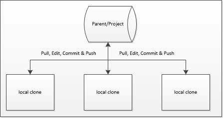
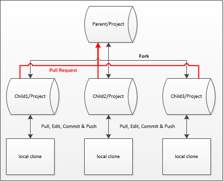
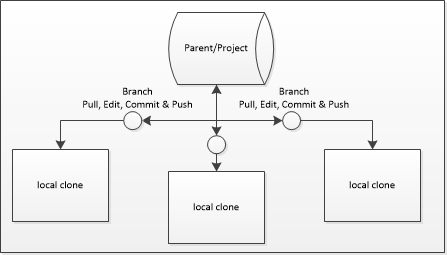
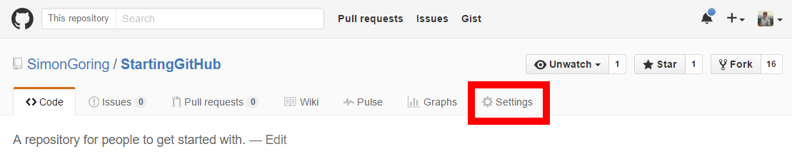

By: Simon Goring

***

**Table of Contents**

* TOC
{:toc}

***

# Coming up with a Plan

There are two main ways to collaborate through GitHub.  Either everyone can share a single repository (the *shared repository* model), or, there can be a **Master** repository and several forks (the *fork and pull* model). In the first scenario each contributor has a local *clone* of the repository, they pull before editing, and then commit and push once they're done.  In the second scenario the individual collaborators *fork* the repository to their own account, pull from the upstream repository (the original), work and commit locally, push, and then create a pull request.  It is important to note that you can use a hybrid model, a *branch and pull* on a shared repository, and for small teams this might be the most advantageous model.  Regardless, I'm going to walk through each model, and then explain the steps required to accomplish each.

## Shared Repository



The advantage of the *shared repository* is that there is only one central repository to worry about.  Nobody is forking, if people are pulling regularly and committing and pushing then, in principle, things should move along tickety-boo.  The big but here ([link](https://www.youtube.com/watch?v=FaVFuX8z26c)) is that because people are pushing into the same repository the chances of having merge conflicts increases as people work more intensively on the project.  Basically, the *shared repository* model works best when you have a small team with well identified roles in the project.  As the project increases in complexity, team size or as overlap among members increases, then this model begins to approach its useful life.


## Fork and Pull



In the Fork and Pull model there is no shared repository, but there is an agreed upon **Master** repository.  In this model, any individual who collaborates would fork the repository to their own account (so `SimonGoring/Project` would get forked by user `YourName` to `YourName/Project`), they would do an *upstream pull* (i.e., pull from the Master branch) before working, commit locally, push to their personal repository, once or multiple times, and then package these up in a *pull request* to the Master branch.  While there is again the possibility of overlap and merge conflicts in this model, there is a key advantage.  All *pull requests* in this model must be approved by a project coordinator.  This means that at least two people have to look at the code (the person making the pull request and the project coordinator), and, because pull requests can happen asynchronously, *i.e.*, the coordinator can decide which pull requests get incorporated, and in which order, there is a greater likelihood that bugs will be caught and dealt with.


## Branch and Pull



The Branch and Pull model uses the shared repository, it uses pull requests, but in the *Branch and Pull* model the pull requests happen between *branches* of the same shared repository, rather than from forks of the same repository.  This is an important distinction. In the *Branch and Pull* model you use the same shared repository, but each contributor creates a *branch* rather than working on the Master.  As the user commits they may then create a *pull request* within the repository, so that there is still a project coordinator, and there is the ability to perform secondary code review.  You get the benefits of some code review, without the hassle of having to fork and assign `upstream` repositories.

***

# Implementing Your Plan

## Shared Repository

For all of these models you must have a GitHub account, and, separate from that, there must be a GitHub repository that you'd like to collaborate with.  If the repository you are working with is not your own then you need to contact the administrator.  The administrator must navigate to their project and click on the *Settings* tab.  But for the purposes of these instructions we'll assume it's your repository and you are adding collaborators.



From there a new menu becomes available on the right hand side.  You click on **Collaborators** here.  At that point you will be asked for your password, and a new page will appear from which you can add collaborators using their username or their email addresses.  This then provides the collaborator with `push` access.

Once you have `push` access to the repository you can set up the *local clone* on your own computer.  You can do this either through RStudio by setting up a **New Project** trough version control, or you can do this using `git` from the command line.  RStudio provides a fairly straightforward approach to `git` version control and has good support that is [well documented](https://support.rstudio.com/hc/en-us/articles/200532077-Version-Control-with-Git-and-SVN).  I will report how to do this from the command line.

There is virtue in learning how to use `git` from the command line.  You may find from time to time that the `git` support in RStudio is insufficient to overcome problems that you might encounter down the line, so being a bit familiar with the command line can help ease fears in the future.  It also gives you a better sense of how things actually work.  So lets get started:

  1.  Open up your command line tool, either using `cmd` or some sort of shell in Windows, or using terminal on your Mac.

  2.  Navigate to the directory you hope to put the repository files into.  `git` will put the repository into a new folder.

  3.  You will now clone the repository (we're assuming it's mine, and it's called `GettingStarted`) using the command:
    ```
    git clone http://github.com/SimonGoring/GettingStarted
    ```

  4. You will now see that there is a new directory called `GettingStarted` in your working directory.  This is a clone of the repository.  You can now open the files with whatever editor you want to use.  If you're using R and RStudio you can use the `git` tools there.  Either way, once you've changed files you will want to `commit` them and then `push` back to the parent repository.  First you want to check the `status` of the local clone to see which files have changed, `add` the important files so that they are *staged* for your next `commit`.  After this you will `commit` the changes with a useful `-m`essage, and then `push` those changes back up to the parent repository.

    ```
    git status
    git add *
    git commit -m "I made some changes."
    git push
    ```

  5. At this point you will be asked for your user name and password, you'll use your own personal user name and password (not the name of the user who created the shared repository).  And you're done!

  6. Except, if you're done, then why is there a number 6?  Because, `clone`ing brings the whole repository onto your computer, but what happens after you've cloned?  When you next want to revisit the code to edit it you'll need to make sure you've got everyone elses' changes.  In that case you need to `pull`:

    ```
    git pull
    ```

  7. Done.

## Fork and Pull

In this model you will first **Fork** the repository, and then repeat most of the steps above, except instead of using `SimonGoring` as the source account you'll use your own account.

  1. To fork, go to the repository you will be collaborating on and simply click the **Fork** button.  This will be straightforward unless your account is somehow associated with multiple organizations.  If this is the case, simply select the organization or account you want to create a copy within.  In most cases it will be your own account.

  2. Repeat the steps above, first cloning from `youraccount/GettingStarted` (replacing `youraccount`) and then editing, checking the `status`, `add`ing all the files (that's what the `*` is for, but you can add only one, or some files), and then `commit`ing the files with a meaningful `-m`essage.

  3. Now, the first tricky part.  Once you've done this, navigate back to _your_ repository on GitHub (not the parent repository).  Click the tab that says **Pull Requests**.  If you have local changes that aren't in the base fork (the parent or upstream fork) then you will see a summary of the changes, information about whether or not the changes can be merged, and a button that will let you **Create Merge Request**.  If you click this button you can add additional information to the set of commits you've made so that the project coordinator will have better context for the changes you've made.

  4.  But what about number 6?!  Yes, we're a bit ahead, but you need to know what to do if someon else has made a Pull request and the base fork has changed.  In this case we need to do two steps, first we need link your local clone to the `upstream` repository (the base fork), then we need to make sure you're on your master, and then you need to merge the changes from the `upstream` fork:

    ```
    git remote add upstream http://github.com/SimonGoring/GettingStarted
    git fetch upstream
    git checkout master
    git merge upstream/master
    ```

  5.  Now you're ready to edit the files again, check it and push it.

## Shared with Branches

In this model 