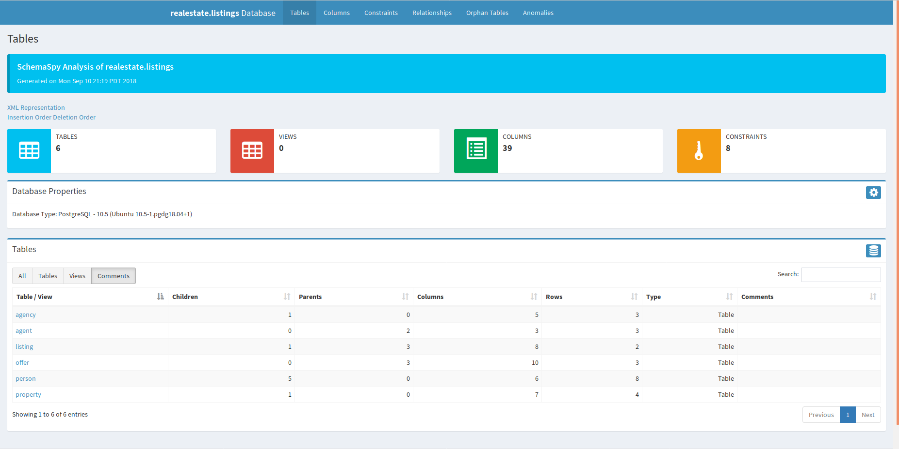

## Summary

I am going to assume the reader has little to no experience with database management systems, but is using them for a project, or beginning to learn about DBMSs.  This tutorial will work for a number of different database systems including PostgreSQL and MySQL, but the reader will have to find the appropriate files themselves (we'll work with Postgres here).

The goal of the tutorial is to use [SchemaSpy](http://schemaspy.org/) to produce a schema diagram for a database that will show the relationships between database elements.  SchemaSpy also compiles a set of HTML documents that provide interactive documentation of a database.

<center>
    <figure>
      
      <figcaption>A nice schema diagram produced by SchemaSpy for a fake database.</figcaption>
    </figure>
</center>

While SchemaSpy is relatively straightforward to install and implement it may be complicated for a first-time user, or a user who is not as familiar with command line tools.  In particular it requires the installation of the Java Database Connectivity library (JDBC) and a specific driver for your database.

## What is the JDBC?

Database management systems (DBMSs) operate by translating SQL commands into a set of read-write operations on physical memory, and are optimized for these kinds of operations, for example `SELECT`, `CREATE` or `INSERT`, basically, they are optimized for data management.  But there are many tools we use with our databases, whether they are web applications, statistical analysis tools, report generation software, or other tools.  Because each of these are optimized for their end use we need some way for the database to "talk" with them, so data can be passed back and forth efficiently.

The JDBC is the Java Database Connectivity Application-Programming Interface (API).  It is built to interact with the (possibly) more familiar ODBC (open Database Connectivity) API.  The ODBC has existed for almost 30 years as an integral part of the database ecosystem.  The (J|O)DBC is the glue that connects databases to the applications that use them for efficient data storage and access.  

## Installing JDBC and the Database Driver

The JDBC is, specifically, designed for use with Java.  As such it requires the [installation of Java](http://www.oracle.com/technetwork/java/javase/downloads/index.html).  Make sure you install the appropriate version of Java for your platform.  It comes with the JDBC as part of the bundle, however, while the JDBC is the core module to interact with a database through Java, each individual database requires a specific driver.  So, for example, there is a second module required to make sure that the JDBC can talk with MySQL specifically, or PostgreSQL, or MariaDB.  This is also the case for ODBC.  For PostgreSQL we can find the JDBC driver on their [JDBC Driver Download page](https://jdbc.postgresql.org/download.html).

When we download the driver we are actually getting a `jar` file, a Java file.  This file should be moved from your `Downloads` folder to somewhere that is generally accessible.  If you are going to deploy the application or share it with someone it may be worthwhile placing it in the project directory.  If it is something that will be used locally, then perhaps you want to put it somewhere you could place multiple JDBC drivers (for other databases).

The main issue is that you need to be able to find it and tell any programs where that `jar` file is.

## Using SchemaSpy and the `JDBC` driver

You now have Java installed, and a copy of the JDBC driver somewhere on your machine.  SchemaSpy can be downloaded from the [SchemaSpy webpage](http://schemaspy.org/).  Copy the `jar` file into the directory you'd like to run it from.

While it is possible to [run SchemaSpy directly from the command line](https://schemaspy.readthedocs.io/en/latest/started.html#running-schemaspy) with all the parameters you need I recommend using a [configuration file for SchemaSpy](https://schemaspy.readthedocs.io/en/latest/started.html).  The configuration file sets up all the parameters you might need, this provides you with a record of the choices you have made, without having to type them out each time.  For my PostgreSQL database I've written the following configuration file (saved as `config.file` in the same folder as the `jar` file):

```
# type of database. Run with -dbhelp for details
schemaspy.t=pgsql
schemaspy.dp=/usr/local/pgsql/share/java/postgresql.jar

# database properties: host, port number, name user, password
schemaspy.host=localhost
schemaspy.port=5432
schemaspy.db=realestate
schemaspy.u=postgres
schemaspy.p=postgres

# output dir to save generated files
schemaspy.o=output/

# db scheme for which generate diagrams
schemaspy.s=listings
schemaspy.illegal-access=warn
schemaspy.imageformat=svg
```

I'm telling SchemaSpy that my database type (`schemaspy.t`) is `pgsql`, and the JDBC driver is in my folder `/usr/local/pgsql/share/java/postgresql.jar` (I renamed it after downloading the file from the Postgres website).  I've used the settings for my postgres database, running on the `localhost` through post `5432`.  It is accessed through the user `postgres` and the password `postgres`.

I've removed the `schemaspy.o` field from my configuration file (a text file I've saved as `config.file`) because I'd like to be able to use this same general configuration with several databases that I manage.  That way when I'm ready I can create a new directory for each project and call:

```bash
java -jar schemaspy-6.0.0-rc2.jar -configFile ./config.file -o OUTPUTFOLDER
```

Given the above setup and that command SchemaSpy will output an entire directory of files.  These files represent a fully realized set of HTML files and interactive elements that represent documentation for your database in the folder defined with the `schemaspy.o` (output) field.  In this folder will be an `index.html` file that acts as the introductory page to your database's documentation.  If you navigate to that file and open it in your browser you should see full documentation for your database.  What a great tool!

<center>
    <figure>
      
      <figcaption>The website layout generated by SchemaSpy.</figcaption>
    </figure>
</center>

One of the nice things is that you can use some of the tabs generated as part of the website to quickly identify things like orphan tables (a table that does not link to any other tables), anomalies (tables without indices or with only a single column) and provides graphic displays of the whole database structure, or of a single table and its connected tables.

## Conclusion

SchemaSpy is a great tool, and seems to provide the opportunity to further customize output and the website structure (for example editing the `css` files to support a branding colour scheme).  I look forward to using it more in our work with Neotoma going forward.
