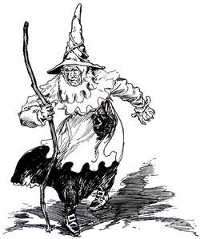

We are faced with "wicked problems"<small>1</small> that require us to leverage multiple datasets, analytic approaches, and research philosophies in an effort to solve some of the most pressing issues facing society today

To solve these wicked problems we need to clearly define problem conditions, develop flexible and open workflows, and build the tools that allow us to take advantage of the knowledge we have been developing across disciplines over the last century for data collection, analysis and assimilation.

[My publication record](http://simongoring.github.io/cv/Publications.html) focuses on relationships between biotic systems and large scale climatic change at time-scales of centuries to millenia, but my research efforts focus on facilitating broader engagement with the tools and methods neccessary to build the technical toolkits we require to move forward as a society.

Domain specific knowledge is important in managing research questions or looking for solutions, but increasingly, this needs to be supported by experience in building research infrastructure, teaching and learning with partners, handling data through complex workflows, and managing projects with multiple interconnected components.  My research activities pair deep understanding in the paleogeosciences with project management skills in geoinformatics, as part of the [Neotoma Paleoecological Database](http://neotomadb.org), and within [EarthCube](http://earthcube.org).

 

<small>1: Rittel & Webber [1973](http://www.uctc.net/mwebber/Rittel+Webber+Dilemmas+General_Theory_of_Planning.pdf).  A wicked problem is a complex problem that often has no clear solution, either because there are competing factors, the conditions change, knowledge is incomplete, or because the problem itself is poorly defined.</small>